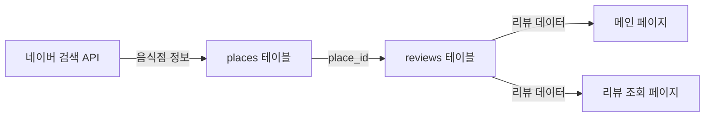
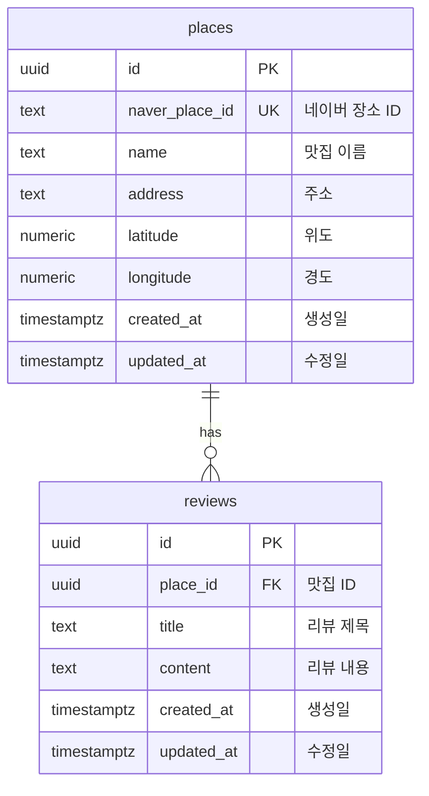

# 데이터베이스 설계 문서

## 문서 정보

- **작성일**: 2025-10-22
- **버전**: 2.0
- **프로젝트명**: 맛집 리뷰 플랫폼
- **데이터베이스**: PostgreSQL (Supabase)

---

## 1. 개요

### 1.1 설계 철학

**간결함과 확장성의 균형**

이 데이터베이스는 YC 스타트업 CTO의 관점에서 설계되었습니다:
- ✅ **MVP에 필요한 최소한의 기능만 구현**
- ✅ **오버엔지니어링 철저히 배제**
- ✅ **향후 확장이 필요한 시점에 추가**
- ✅ **PRD에 명시된 기능만 포함**

### 1.2 설계 범위

**포함 범위** (PRD P0/P1 기능):
- 맛집 정보 저장 (네이버 검색 API 연동)
- 리뷰 CRUD (제목, 내용만)
- 위치 기반 맛집 조회
- 자동 타임스탬프 관리

**명시적 제외 범위** (PRD에서 제외됨):
- ❌ 평점(rating) 시스템 → Phase 5
- ❌ 이미지 업로드 → Phase 5
- ❌ 사용자 인증/회원 관리 → Phase 4
- ❌ 좋아요/북마크 → Phase 5
- ❌ 댓글 기능 → Phase 5

### 1.3 설계 원칙

1. **최소주의**: 사용하지 않을 컬럼은 추가하지 않음
2. **정규화**: 데이터 중복 최소화 (3NF)
3. **성능**: 실제 쿼리 패턴에 맞춘 인덱스만 추가
4. **무결성**: 제약조건으로 잘못된 데이터 방지
5. **확장성**: 향후 컬럼 추가가 쉬운 구조

---

## 2. 데이터 플로우

### 2.1 핵심 데이터 흐름



### 2.2 유저플로우별 데이터 접근 패턴

| 유저플로우 | 사용 테이블 | 주요 쿼리 |
|----------|-----------|---------|
| 메인 페이지 진입 | places, reviews | 리뷰가 있는 맛집 목록 조회 |
| 음식점 검색 | places | naver_place_id로 중복 확인 |
| 리뷰 작성 | places, reviews | place INSERT → review INSERT |
| 리뷰 조회 | places, reviews | place_id로 리뷰 목록 조회 |
| 리뷰 삭제 | reviews | review_id로 삭제 |

---

## 3. ERD 다이어그램

### 3.1 전체 ERD



### 3.2 테이블 관계

| 관계 | 부모 | 자식 | 타입 | CASCADE |
|-----|------|-----|------|---------|
| 1 | places | reviews | 1:N | ON DELETE CASCADE |

---

## 4. 테이블 정의

### 4.1 places (맛집 정보)

#### 4.1.1 테이블 목적

네이버 검색 API에서 가져온 음식점 정보를 저장합니다. `naver_place_id`를 UNIQUE 제약으로 중복 등록을 방지합니다.

#### 4.1.2 컬럼 정의

| 컬럼명 | 타입 | 제약 | 기본값 | 설명 |
|-------|-----|-----|-------|-----|
| id | UUID | PRIMARY KEY | gen_random_uuid() | 내부 고유 ID |
| naver_place_id | TEXT | UNIQUE NOT NULL | - | 네이버 장소 ID |
| name | TEXT | NOT NULL | - | 음식점 이름 |
| address | TEXT | NOT NULL | - | 주소 |
| latitude | NUMERIC(9, 6) | NOT NULL | - | 위도 |
| longitude | NUMERIC(9, 6) | NOT NULL | - | 경도 |
| created_at | TIMESTAMPTZ | NOT NULL | NOW() | 생성 시각 |
| updated_at | TIMESTAMPTZ | NOT NULL | NOW() | 수정 시각 |

#### 4.1.3 인덱스

| 인덱스명 | 컬럼 | 목적 |
|---------|------|------|
| places_pkey | id | PRIMARY KEY |
| idx_places_naver_id | naver_place_id | 중복 확인 + 검색 |
| idx_places_location | (latitude, longitude) | 지도 영역 검색 |

#### 4.1.4 제약조건

```sql
-- 네이버 장소 ID 중복 방지
UNIQUE (naver_place_id)

-- 한국 영역 좌표 검증
CHECK (latitude BETWEEN 33 AND 43)
CHECK (longitude BETWEEN 124 AND 132)
```

#### 4.1.5 비고

- **category 제거**: PRD에서 카테고리 필터 기능이 제외됨
- **좌표 정밀도**: NUMERIC(9, 6)은 약 10cm 정밀도 (충분함)
- **네이버 API 매핑**:
  - `mapx` / 1000000 → longitude
  - `mapy` / 1000000 → latitude

---

### 4.2 reviews (리뷰)

#### 4.2.1 테이블 목적

사용자가 작성한 리뷰를 저장합니다. 비로그인 시스템이므로 작성자 정보는 저장하지 않습니다.

#### 4.2.2 컬럼 정의

| 컬럼명 | 타입 | 제약 | 기본값 | 설명 |
|-------|-----|-----|-------|-----|
| id | UUID | PRIMARY KEY | gen_random_uuid() | 리뷰 고유 ID |
| place_id | UUID | NOT NULL, FK | - | 맛집 ID |
| title | TEXT | NOT NULL, CHECK | - | 제목 (1~50자) |
| content | TEXT | NOT NULL, CHECK | - | 내용 (1~500자) |
| created_at | TIMESTAMPTZ | NOT NULL | NOW() | 작성 시각 |
| updated_at | TIMESTAMPTZ | NOT NULL | NOW() | 수정 시각 |

#### 4.2.3 인덱스

| 인덱스명 | 컬럼 | 목적 |
|---------|------|------|
| reviews_pkey | id | PRIMARY KEY |
| idx_reviews_place_id | place_id | 맛집별 리뷰 조회 |
| idx_reviews_created_at | created_at DESC | 최신순 정렬 |

#### 4.2.4 제약조건

```sql
-- 외래 키 (CASCADE 삭제)
FOREIGN KEY (place_id) REFERENCES places(id) ON DELETE CASCADE

-- 제목 길이 제한
CHECK (char_length(title) BETWEEN 1 AND 50)

-- 내용 길이 제한
CHECK (char_length(content) BETWEEN 1 AND 500)
```

#### 4.2.5 비고

- **author_name 제거**: 비로그인 시스템에서 의미 없음 (검증 불가)
- **rating 제거**: PRD에서 평점 시스템이 Phase 5로 연기됨
- **리뷰 수정 불가**: PRD에 수정 기능 제외됨 (삭제 후 재작성만 가능)

---

## 5. 인덱스 전략

### 5.1 인덱스 선택 기준

**추가한 인덱스**:
1. `idx_places_naver_id`: 네이버 ID로 맛집 검색 (리뷰 작성 시 중복 확인)
2. `idx_places_location`: 지도 영역 내 맛집 검색 (향후 확장)
3. `idx_reviews_place_id`: 맛집별 리뷰 목록 조회 (가장 빈번)
4. `idx_reviews_created_at`: 최신순 정렬 (DESC 인덱스)

**제거한 인덱스** (기존 설계에 있었지만 불필요):
- ❌ `idx_places_name`: 이름 검색은 네이버 API에서 처리
- ❌ `idx_reviews_rating`: rating 컬럼이 제거됨
- ❌ `idx_reviews_author_name`: author_name 컬럼이 제거됨

### 5.2 쿼리 패턴 분석

| 쿼리 | 빈도 | 사용 인덱스 | 성능 |
|-----|-----|-----------|------|
| 리뷰가 있는 맛집 목록 | 높음 | idx_reviews_place_id | O(log N) |
| 특정 맛집 리뷰 조회 | 높음 | idx_reviews_place_id + idx_reviews_created_at | O(log N) |
| 네이버 ID로 맛집 검색 | 중간 | idx_places_naver_id | O(1) |
| 지도 영역 검색 | 낮음 | idx_places_location | O(log N) |

---

## 6. 트리거

### 6.1 updated_at 자동 갱신

#### 6.1.1 트리거 함수

```sql
CREATE OR REPLACE FUNCTION update_updated_at_column()
RETURNS TRIGGER AS $$
BEGIN
    NEW.updated_at = NOW();
    RETURN NEW;
END;
$$ LANGUAGE plpgsql;
```

#### 6.1.2 트리거 적용

```sql
CREATE TRIGGER update_places_updated_at
BEFORE UPDATE ON places
FOR EACH ROW
EXECUTE FUNCTION update_updated_at_column();

CREATE TRIGGER update_reviews_updated_at
BEFORE UPDATE ON reviews
FOR EACH ROW
EXECUTE FUNCTION update_updated_at_column();
```

---

## 7. 주요 쿼리

### 7.1 리뷰가 있는 맛집 목록 (메인 페이지)

```sql
SELECT
  p.id,
  p.naver_place_id,
  p.name,
  p.address,
  p.latitude,
  p.longitude,
  COUNT(r.id) AS review_count,
  (
    SELECT r2.content
    FROM reviews r2
    WHERE r2.place_id = p.id
    ORDER BY r2.created_at DESC
    LIMIT 1
  ) AS latest_review_preview
FROM places p
INNER JOIN reviews r ON p.id = r.place_id
GROUP BY p.id
HAVING COUNT(r.id) > 0
ORDER BY COUNT(r.id) DESC;
```

**성능**:
- `INNER JOIN`으로 리뷰가 없는 맛집 제외
- `GROUP BY`로 맛집별 리뷰 개수 집계
- 서브쿼리로 최신 리뷰 미리보기

### 7.2 특정 맛집의 리뷰 목록 (리뷰 조회 페이지)

```sql
-- 1. 맛집 정보 조회
SELECT
  id,
  naver_place_id,
  name,
  address,
  latitude,
  longitude
FROM places
WHERE naver_place_id = $1;

-- 2. 해당 맛집의 리뷰 목록 (최신순)
SELECT
  id,
  title,
  content,
  created_at
FROM reviews
WHERE place_id = $1
ORDER BY created_at DESC;
```

**성능**:
- `idx_reviews_place_id`로 빠른 필터링
- `idx_reviews_created_at DESC`로 정렬 최적화

### 7.3 리뷰 작성 (트랜잭션)

```sql
BEGIN;

-- 1. 맛집이 이미 존재하는지 확인
INSERT INTO places (naver_place_id, name, address, latitude, longitude)
VALUES ($1, $2, $3, $4, $5)
ON CONFLICT (naver_place_id) DO NOTHING
RETURNING id;

-- 2. 리뷰 작성
INSERT INTO reviews (place_id, title, content)
VALUES (
  (SELECT id FROM places WHERE naver_place_id = $1),
  $6,
  $7
)
RETURNING id;

COMMIT;
```

**비즈니스 로직**:
- `ON CONFLICT`로 맛집 중복 등록 방지
- 트랜잭션으로 원자성 보장

### 7.4 리뷰 삭제

```sql
DELETE FROM reviews
WHERE id = $1
RETURNING place_id;
```

**참고**: CASCADE로 연관 데이터는 자동 삭제되지만, 현재는 연관 테이블이 없음

---

## 8. 제약사항

### 8.1 보안

**RLS (Row Level Security)**:
```sql
-- RLS 비활성화 (비로그인 시스템)
ALTER TABLE places DISABLE ROW LEVEL SECURITY;
ALTER TABLE reviews DISABLE ROW LEVEL SECURITY;
```

**사유**:
- 비로그인 시스템으로 사용자 인증 없음
- 모든 데이터는 공개 (개인정보 없음)
- API 레이어(Hono)에서 비즈니스 로직 검증

**보안 대책**:
- Zod 스키마로 입력 데이터 검증
- Supabase 클라이언트의 파라미터 바인딩으로 SQL Injection 방지
- Rate Limiting (향후 추가 고려)

### 8.2 명명 규칙

| 항목 | 규칙 | 예시 |
|-----|------|------|
| 테이블명 | snake_case, 복수형 | places, reviews |
| 컬럼명 | snake_case | naver_place_id, created_at |
| 인덱스명 | idx_{table}_{column} | idx_places_naver_id |
| 제약조건명 | chk_{table}_{column} | chk_reviews_title_length |
| 외래키명 | fk_{table}_{column} | fk_reviews_place_id |

---

## 9. 마이그레이션 계획

### 9.1 마이그레이션 파일 순서

| 순서 | 파일명 | 설명 |
|-----|--------|------|
| 1 | 0002_create_places_table.sql | places 테이블 생성 |
| 2 | 0003_create_reviews_table.sql | reviews 테이블 생성 |
| 3 | 0004_create_updated_at_trigger.sql | updated_at 트리거 생성 |

**참고**: 0001_create_example_table.sql은 기존 예제 파일

### 9.2 롤백 계획

```sql
-- 역순 삭제
DROP TRIGGER IF EXISTS update_reviews_updated_at ON reviews;
DROP TRIGGER IF EXISTS update_places_updated_at ON places;
DROP FUNCTION IF EXISTS update_updated_at_column();

DROP TABLE IF EXISTS reviews CASCADE;
DROP TABLE IF EXISTS places CASCADE;
```

---

## 10. 데이터 예시

### 10.1 places 샘플 데이터

```sql
INSERT INTO places (naver_place_id, name, address, latitude, longitude) VALUES
('1234567890', '맛있는 파스타', '서울특별시 마포구 홍익로 123', 37.551169, 126.923979),
('0987654321', '전통 한정식', '서울특별시 종로구 인사동길 456', 37.573088, 126.984867);
```

### 10.2 reviews 샘플 데이터

```sql
INSERT INTO reviews (place_id, title, content) VALUES
(
  (SELECT id FROM places WHERE naver_place_id = '1234567890'),
  '파스타가 정말 맛있어요',
  '크림 파스타 추천합니다. 양도 푸짐하고 가격도 합리적이에요.'
),
(
  (SELECT id FROM places WHERE naver_place_id = '1234567890'),
  '분위기 좋은 이탈리안',
  '데이트 코스로 추천합니다. 다만 웨이팅이 조금 있어요.'
);
```

---

## 11. 주요 설계 결정사항

### 11.1 평점(rating) 제거

**기존 설계**: `reviews.rating INTEGER NOT NULL`
**개선 설계**: 컬럼 제거

**사유**:
- PRD 8.2절에서 "평점 시스템"을 명시적으로 제외 범위로 명시
- MVP 범위를 벗어나는 오버엔지니어링
- 향후 Phase 5에서 추가 가능

### 11.2 이미지 테이블(review_images) 제거

**기존 설계**: `review_images` 테이블 존재
**개선 설계**: 테이블 제거

**사유**:
- PRD 8.2절에서 "사진 업로드"를 명시적으로 제외 범위로 명시
- 불필요한 복잡도 증가
- Supabase Storage 연동 작업이 MVP에 불필요

### 11.3 작성자 이름(author_name) 제거

**기존 설계**: `reviews.author_name TEXT NOT NULL`
**개선 설계**: 컬럼 제거

**사유**:
- 비로그인 시스템에서 작성자를 검증할 방법이 없음
- 임의의 이름 입력은 스팸/어뷰징에 취약
- 리뷰 삭제 권한 관리 불가능
- PRD에서 "비로그인 상태에서 모든 기능 이용"만 명시, 작성자 표시는 언급 없음

**트레이드오프**:
- 리뷰 작성자 표시 불가 → 수용 (MVP 범위)
- 향후 Phase 4에서 인증 도입 시 `user_id` 컬럼 추가

### 11.4 카테고리(category) 제거

**기존 설계**: `places.category TEXT`
**개선 설계**: 컬럼 제거

**사유**:
- PRD 4.1절에서 "음식점 카테고리 필터"가 Phase 6(고도화)로 연기됨
- 현재 사용하지 않는 컬럼은 추가하지 않음
- 네이버 API 응답에는 포함되지만 저장할 필요 없음

### 11.5 좌표 NOT NULL 강제

**기존 설계**: `latitude`, `longitude` NULL 허용
**개선 설계**: NOT NULL 강제

**사유**:
- 지도 기반 서비스에서 좌표는 필수
- 네이버 검색 API 응답은 항상 좌표 포함
- NULL 허용 시 예외 처리 로직 복잡도 증가

### 11.6 인덱스 최소화

**기존 설계**: 8개 인덱스
**개선 설계**: 5개 인덱스 (PK 포함)

**제거한 인덱스**:
- `idx_places_name`: 이름 검색은 네이버 API 사용
- `idx_reviews_rating`: rating 컬럼 제거됨
- `idx_review_images_*`: review_images 테이블 제거됨

**사유**:
- 인덱스는 쓰기 성능 저하의 원인
- MVP에서는 데이터가 적어 Full Scan도 충분히 빠름
- 실제 병목 발생 시 추가하는 것이 효율적

---

## 12. 확장 계획

### 12.1 Phase 4: 사용자 인증 도입

```sql
-- 1. users 테이블 추가
CREATE TABLE users (
  id UUID PRIMARY KEY DEFAULT gen_random_uuid(),
  email TEXT UNIQUE NOT NULL,
  created_at TIMESTAMPTZ DEFAULT NOW()
);

-- 2. reviews에 user_id 추가
ALTER TABLE reviews ADD COLUMN user_id UUID REFERENCES users(id);

-- 3. 기존 리뷰는 NULL 유지 (익명 리뷰로 처리)
-- 4. 새 리뷰는 user_id 필수로 변경
ALTER TABLE reviews ALTER COLUMN user_id SET NOT NULL;
```

### 12.2 Phase 5: 평점 및 이미지 추가

```sql
-- 1. 평점 컬럼 추가
ALTER TABLE reviews ADD COLUMN rating INTEGER CHECK (rating BETWEEN 1 AND 5);

-- 2. 이미지 테이블 추가
CREATE TABLE review_images (
  id UUID PRIMARY KEY DEFAULT gen_random_uuid(),
  review_id UUID NOT NULL REFERENCES reviews(id) ON DELETE CASCADE,
  image_url TEXT NOT NULL,
  display_order INTEGER NOT NULL DEFAULT 1,
  created_at TIMESTAMPTZ DEFAULT NOW()
);
```

### 12.3 Phase 6: 카테고리 필터

```sql
-- 1. places에 category 추가
ALTER TABLE places ADD COLUMN category TEXT;

-- 2. 카테고리 인덱스 추가
CREATE INDEX idx_places_category ON places(category);
```

---

## 13. 성능 모니터링

### 13.1 주요 지표

| 지표 | 목표 | 측정 방법 |
|-----|-----|---------|
| 메인 페이지 쿼리 | < 100ms | Supabase Dashboard |
| 리뷰 조회 쿼리 | < 50ms | Supabase Dashboard |
| 리뷰 작성 쿼리 | < 200ms | Supabase Dashboard |
| 인덱스 사용률 | > 80% | pg_stat_user_indexes |

### 13.2 확장 임계값

| 데이터량 | 대응 |
|---------|-----|
| ~1,000 리뷰 | 현재 설계 유지 |
| 1,000~10,000 리뷰 | 쿼리 최적화 검토 |
| 10,000+ 리뷰 | Materialized View 도입 고려 |

---

## 14. 변경 이력

| 버전 | 날짜 | 작성자 | 변경 내용 |
|-----|------|--------|----------|
| 1.0 | 2025-10-22 | - | 초기 데이터베이스 설계 |
| 2.0 | 2025-10-22 | CTO | PRD 기준 재설계 (오버엔지니어링 제거) |

**주요 변경사항** (v1.0 → v2.0):
- ❌ `reviews.rating` 제거 (PRD 제외 범위)
- ❌ `reviews.author_name` 제거 (비로그인 시스템에서 무의미)
- ❌ `review_images` 테이블 제거 (PRD 제외 범위)
- ❌ `places.category` 제거 (Phase 6 기능)
- ✅ `places.latitude`, `places.longitude` NOT NULL 강제
- ✅ 불필요한 인덱스 3개 제거
- ✅ 좌표 정밀도 조정 (10, 7) → (9, 6)

---

## 15. 다음 단계

### 15.1 즉시 실행

- [ ] 마이그레이션 파일 작성 (0002~0004)
- [ ] Supabase에 마이그레이션 적용
- [ ] 샘플 데이터 INSERT 테스트

### 15.2 개발 중

- [ ] Hono 백엔드에서 Zod 스키마 작성
- [ ] 주요 쿼리 성능 테스트

### 15.3 운영 후

- [ ] 슬로우 쿼리 모니터링
- [ ] 인덱스 사용률 분석
- [ ] 데이터 증가량 추적

---

**문서 승인**:
- CTO: [✓]
- Backend Developer: [ ]
- Frontend Developer: [ ]

---

**참고 문서**:
- [PRD 문서](./prd.md)
- [User Flow 문서](./userflow.md)
- [Supabase Migration Guideline](../.ruler/supabase.md)
