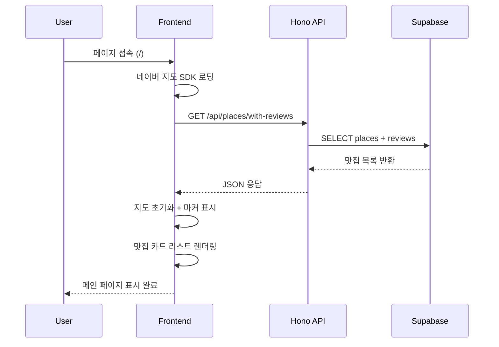

# 메인 페이지 구현 계획

## 문서 정보

- **페이지명**: 메인 페이지 (Root Page)
- **경로**: `/`
- **관련 유스케이스**: UC-001 (메인 페이지 접속 및 탐색), UC-005 (지도 인터랙션)
- **작성일**: 2025-10-23
- **버전**: 1.0

---

## 1. 개요

### 1.1 페이지 목적

사용자가 처음 애플리케이션에 접속하여 서비스를 이해하고, 지도 기반으로 리뷰가 등록된 맛집을 탐색하며, 음식점 검색을 시작할 수 있는 진입점 역할을 한다.

### 1.2 핵심 기능

1. **서비스 소개 섹션**: 서비스명, 캐치프레이즈, 간단한 사용 가이드
2. **네이버 지도 뷰**: 리뷰가 있는 맛집 위치 마커 표시 및 인터랙션
3. **맛집 카드 리스트**: 리뷰 개수 내림차순으로 맛집 목록 표시
4. **음식점 검색창**: 디바운스 적용, 검색 결과 드롭다운

### 1.3 제외 범위

- 리뷰 작성 기능 (별도 페이지)
- 리뷰 상세 조회 (별도 페이지)
- 사용자 인증 (Phase 4)
- 평점 시스템 (Phase 5)

---

## 2. 화면 구성

### 2.1 레이아웃 (상단 → 하단)

```
┌─────────────────────────────────────┐
│  1. 서비스 소개 섹션 (Hero)          │
│     - 서비스명                       │
│     - 캐치프레이즈                   │
│     - 간단한 사용 가이드 (1-2줄)    │
├─────────────────────────────────────┤
│  2. 네이버 지도 (Interactive Map)    │
│     - 초기 중심: 서울 시청           │
│     - 줌 레벨: 13                    │
│     - 리뷰가 있는 맛집 마커 표시     │
│     - 마커 클릭 → 인포윈도우 표시    │
├─────────────────────────────────────┤
│  3. 맛집 카드 리스트 (Grid)          │
│     각 카드:                         │
│     - 맛집 이름                      │
│     - 주소                           │
│     - 리뷰 개수                      │
│     - 최근 리뷰 미리보기 (1줄)       │
│     - 카드 클릭 → 리뷰 조회 페이지   │
├─────────────────────────────────────┤
│  4. 음식점 검색창 (Search Bar)       │
│     - Placeholder: "음식점 검색..."  │
│     - 디바운스: 500ms                │
│     - 결과 드롭다운 (최대 5개)       │
└─────────────────────────────────────┘
```

### 2.2 반응형 디자인

- **모바일** (< 768px):
  - 1열 레이아웃
  - 지도 높이: 300px
  - 카드 리스트: 1열
  - 검색창: 하단 고정 (Fixed)
- **태블릿** (768px ~ 1024px):
  - 지도 높이: 400px
  - 카드 리스트: 2열
- **데스크톱** (> 1024px):
  - 지도 높이: 500px
  - 카드 리스트: 3열

---

## 3. 데이터 플로우

### 3.1 API 요청 흐름



### 3.2 사용 API 목록

| API 엔드포인트 | 메서드 | 용도 | 구현 상태 |
|---------------|-------|------|----------|
| `/api/places/with-reviews` | GET | 리뷰가 있는 맛집 목록 조회 | ✅ 완료 (공통 모듈) |
| `/api/naver/search/local?query={query}&display=5` | GET | 음식점 검색 (프록시) | ✅ 완료 (공통 모듈) |

### 3.3 데이터 타입

**맛집 목록 응답**:
```typescript
type PlaceWithReviews = {
  id: string;
  naverPlaceId: string;
  name: string;
  address: string;
  latitude: number;
  longitude: number;
  reviewCount: number;
  latestReview: {
    title: string;
    content: string;
    createdAt: string;
  } | null;
};
```

**검색 결과 응답**:
```typescript
type NaverSearchItem = {
  title: string;
  link?: string;
  category?: string;
  address: string;
  roadAddress: string;
  mapx: string; // 경도 * 10^7
  mapy: string; // 위도 * 10^7
};
```

---

## 4. 컴포넌트 구조

### 4.1 파일 구조

```
src/app/
└── page.tsx                           # 메인 페이지 (기존 파일 대체)

src/features/main-page/
├── components/
│   ├── HeroSection.tsx                # 서비스 소개 섹션
│   ├── MapSection.tsx                 # 네이버 지도 + 마커
│   ├── PlaceCardList.tsx              # 맛집 카드 리스트
│   ├── PlaceCard.tsx                  # 개별 맛집 카드
│   ├── SearchBar.tsx                  # 음식점 검색창
│   └── SearchResultDropdown.tsx       # 검색 결과 드롭다운
├── hooks/
│   ├── usePlacesWithReviews.ts        # 맛집 목록 조회 React Query 훅
│   ├── useNaverSearch.ts              # 음식점 검색 React Query 훅
│   └── useNaverMap.ts                 # 네이버 지도 초기화 및 마커 관리
└── lib/
    └── constants.ts                   # 지도 초기 설정 상수
```

### 4.2 컴포넌트 설계

#### 4.2.1 HeroSection

**목적**: 서비스 소개 및 사용 가이드 표시

**Props**: 없음

**상태**: 없음

**UI**:
```tsx
<section className="bg-gradient-to-br from-blue-500 to-purple-600 text-white py-12 px-6">
  <div className="max-w-4xl mx-auto text-center space-y-4">
    <h1 className="text-4xl font-bold">맛집 리뷰 플랫폼</h1>
    <p className="text-lg">지도로 찾고, 리뷰로 공유하는 우리 동네 맛집</p>
    <p className="text-sm opacity-90">
      로그인 없이 바로 시작하세요. 검색 → 리뷰 작성 → 공유
    </p>
  </div>
</section>
```

---

#### 4.2.2 MapSection

**목적**: 네이버 지도 렌더링 및 맛집 마커 표시

**Props**:
```typescript
type MapSectionProps = {
  places: PlaceWithReviews[];
  isLoading: boolean;
};
```

**사용 훅**: `useNaverMap(places)`

**주요 로직**:
1. 네이버 Maps SDK 로딩 확인 (`window.naver` 존재 여부)
2. 지도 초기화 (중심: 서울 시청, 줌: 13)
3. 각 맛집에 마커 생성
4. 마커 클릭 → 인포윈도우 표시 (맛집명, 리뷰 개수, "자세히 보기" 버튼)
5. "자세히 보기" 클릭 → `/review/[placeId]` 이동

**에러 처리**:
- SDK 로딩 실패 시: "지도를 불러올 수 없습니다" 메시지 표시

**UI 구조**:
```tsx
{isMapLoaded ? (
  <div id="naver-map" className="w-full h-[400px] md:h-[500px]" />
) : (
  <div className="w-full h-[400px] flex items-center justify-center bg-gray-100">
    <p className="text-gray-500">지도를 불러오는 중...</p>
  </div>
)}
```

---

#### 4.2.3 PlaceCardList

**목적**: 맛집 카드 리스트 표시

**Props**:
```typescript
type PlaceCardListProps = {
  places: PlaceWithReviews[];
  isLoading: boolean;
};
```

**정렬**: 리뷰 개수 내림차순 (백엔드에서 이미 정렬됨)

**빈 상태**:
```tsx
{places.length === 0 && (
  <div className="text-center py-12">
    <p className="text-gray-500 mb-4">
      아직 등록된 리뷰가 없습니다.
    </p>
    <p className="text-sm text-gray-400">
      첫 번째 리뷰를 작성해보세요!
    </p>
  </div>
)}
```

**로딩 상태**: shadcn-ui `Skeleton` 사용 (카드 3개)

**UI 구조**:
```tsx
<div className="grid grid-cols-1 md:grid-cols-2 lg:grid-cols-3 gap-6">
  {places.map((place) => (
    <PlaceCard key={place.id} place={place} />
  ))}
</div>
```

---

#### 4.2.4 PlaceCard

**목적**: 개별 맛집 정보 카드

**Props**:
```typescript
type PlaceCardProps = {
  place: PlaceWithReviews;
};
```

**UI 구조**:
```tsx
<Card className="cursor-pointer hover:shadow-lg transition">
  <CardHeader>
    <CardTitle>{place.name}</CardTitle>
    <CardDescription>{place.address}</CardDescription>
  </CardHeader>
  <CardContent>
    <p className="text-sm text-gray-500">
      리뷰 {place.reviewCount}개
    </p>
    {place.latestReview && (
      <p className="text-sm text-gray-700 mt-2 line-clamp-1">
        {place.latestReview.content}
      </p>
    )}
  </CardContent>
</Card>
```

**클릭 이벤트**: `router.push(`/review/${place.naverPlaceId}`)`

---

#### 4.2.5 SearchBar

**목적**: 음식점 검색 입력창 및 디바운스 처리

**Props**: 없음

**상태**:
```typescript
const [searchQuery, setSearchQuery] = useState('');
const debouncedQuery = useDebounce(searchQuery, 500);
```

**사용 훅**: `useNaverSearch(debouncedQuery)`

**UI 구조**:
```tsx
<div className="relative">
  <Input
    type="text"
    placeholder="음식점 검색..."
    value={searchQuery}
    onChange={(e) => setSearchQuery(e.target.value)}
    className="w-full"
  />
  {debouncedQuery && (
    <SearchResultDropdown results={searchResults} />
  )}
</div>
```

---

#### 4.2.6 SearchResultDropdown

**목적**: 검색 결과 드롭다운 표시

**Props**:
```typescript
type SearchResultDropdownProps = {
  results: NaverSearchItem[];
  isLoading: boolean;
};
```

**UI 구조**:
```tsx
<div className="absolute top-full left-0 right-0 mt-2 bg-white border rounded-md shadow-lg max-h-80 overflow-y-auto z-10">
  {results.map((item, index) => (
    <button
      key={index}
      onClick={() => handleSelectPlace(item)}
      className="w-full text-left px-4 py-3 hover:bg-gray-100 border-b last:border-0"
    >
      <p className="font-medium" dangerouslySetInnerHTML={{ __html: item.title }} />
      <p className="text-sm text-gray-500">{item.address}</p>
    </button>
  ))}
</div>
```

**클릭 이벤트**:
```typescript
const handleSelectPlace = (item: NaverSearchItem) => {
  const { latitude, longitude } = convertNaverCoordinates(item.mapx, item.mapy);
  const cleanTitle = stripHtmlTags(item.title);

  router.push(`/review/new?naverPlaceId=${encodeURIComponent(cleanTitle)}&placeName=${encodeURIComponent(cleanTitle)}&address=${encodeURIComponent(item.address)}&latitude=${latitude}&longitude=${longitude}`);
};
```

---

## 5. 상태 관리

### 5.1 클라이언트 상태 (useState)

| 상태명 | 타입 | 용도 | 초기값 |
|--------|------|------|--------|
| `searchQuery` | `string` | 검색 입력값 | `''` |
| `currentInfoWindow` | `naver.maps.InfoWindow \| null` | 현재 열린 인포윈도우 | `null` |
| `isMapLoaded` | `boolean` | 네이버 지도 SDK 로딩 완료 여부 | `false` |

### 5.2 서버 상태 (React Query)

| 쿼리 키 | API | 캐싱 | 재시도 |
|---------|-----|------|--------|
| `['places', 'with-reviews']` | `GET /api/places/with-reviews` | staleTime: 5분 | 3회 |
| `['naver', 'search', debouncedQuery]` | `GET /api/naver/search/local?query=${query}` | staleTime: 1분 | 1회 |

### 5.3 전역 상태

**없음** (메인 페이지는 로컬 상태만 사용)

---

## 6. 훅 구현 계획

### 6.1 usePlacesWithReviews

**파일**: `src/features/main-page/hooks/usePlacesWithReviews.ts`

```typescript
import { useQuery } from '@tanstack/react-query';
import { apiClient } from '@/lib/remote/api-client';
import type { PlaceWithReviews } from '@/features/places/lib/dto';

export const usePlacesWithReviews = () => {
  return useQuery({
    queryKey: ['places', 'with-reviews'],
    queryFn: async () => {
      const response = await apiClient.get<{ success: true; data: PlaceWithReviews[] }>(
        '/places/with-reviews'
      );
      return response.data.data;
    },
    staleTime: 1000 * 60 * 5, // 5분
    retry: 3,
  });
};
```

---

### 6.2 useNaverSearch

**파일**: `src/features/main-page/hooks/useNaverSearch.ts`

```typescript
import { useQuery } from '@tanstack/react-query';
import { apiClient } from '@/lib/remote/api-client';
import type { SearchResponse } from '@/features/naver-proxy/lib/dto';

export const useNaverSearch = (query: string, enabled: boolean = true) => {
  return useQuery({
    queryKey: ['naver', 'search', query],
    queryFn: async () => {
      if (!query.trim()) return { items: [] };

      const response = await apiClient.get<{ success: true; data: SearchResponse }>(
        `/naver/search/local?query=${encodeURIComponent(query)}&display=5`
      );
      return response.data.data;
    },
    enabled: enabled && query.trim().length > 0,
    staleTime: 1000 * 60, // 1분
    retry: 1,
  });
};
```

---

### 6.3 useNaverMap

**파일**: `src/features/main-page/hooks/useNaverMap.ts`

```typescript
import { useEffect, useRef, useState } from 'react';
import { useRouter } from 'next/navigation';
import type { PlaceWithReviews } from '@/features/places/lib/dto';

const DEFAULT_CENTER = { lat: 37.5665, lng: 126.9780 }; // 서울 시청
const DEFAULT_ZOOM = 13;

export const useNaverMap = (places: PlaceWithReviews[]) => {
  const mapRef = useRef<naver.maps.Map | null>(null);
  const markersRef = useRef<naver.maps.Marker[]>([]);
  const currentInfoWindowRef = useRef<naver.maps.InfoWindow | null>(null);
  const [isMapLoaded, setIsMapLoaded] = useState(false);
  const router = useRouter();

  // 네이버 지도 초기화
  useEffect(() => {
    if (typeof window === 'undefined') return;

    const initMap = () => {
      if (!window.naver?.maps) {
        console.error('네이버 지도 SDK가 로드되지 않았습니다.');
        return;
      }

      const mapElement = document.getElementById('naver-map');
      if (!mapElement || mapRef.current) return;

      const map = new naver.maps.Map(mapElement, {
        center: new naver.maps.LatLng(DEFAULT_CENTER.lat, DEFAULT_CENTER.lng),
        zoom: DEFAULT_ZOOM,
      });

      mapRef.current = map;
      setIsMapLoaded(true);
    };

    // SDK 로딩 대기
    if (window.naver?.maps) {
      initMap();
    } else {
      const timer = setTimeout(initMap, 1000);
      return () => clearTimeout(timer);
    }
  }, []);

  // 마커 생성 및 업데이트
  useEffect(() => {
    if (!mapRef.current || !isMapLoaded || places.length === 0) return;

    // 기존 마커 제거
    markersRef.current.forEach((marker) => marker.setMap(null));
    markersRef.current = [];

    // 새 마커 생성
    places.forEach((place) => {
      const marker = new naver.maps.Marker({
        position: new naver.maps.LatLng(place.latitude, place.longitude),
        map: mapRef.current!,
        title: place.name,
      });

      // 마커 클릭 이벤트
      naver.maps.Event.addListener(marker, 'click', () => {
        // 기존 인포윈도우 닫기
        if (currentInfoWindowRef.current) {
          currentInfoWindowRef.current.close();
        }

        // 인포윈도우 생성
        const infoWindow = new naver.maps.InfoWindow({
          content: `
            <div style="padding: 15px; min-width: 200px;">
              <h3 style="margin: 0 0 10px 0; font-size: 16px; font-weight: 600;">${place.name}</h3>
              <p style="margin: 0 0 10px 0; color: #666; font-size: 14px;">리뷰 ${place.reviewCount}개</p>
              <a
                href="/review/${place.naverPlaceId}"
                style="display: inline-block; padding: 8px 16px; background: #4285f4; color: white; text-decoration: none; border-radius: 4px; font-size: 14px;"
                onclick="event.stopPropagation();"
              >
                자세히 보기
              </a>
            </div>
          `,
          borderWidth: 0,
          disableAnchor: true,
          backgroundColor: 'transparent',
        });

        infoWindow.open(mapRef.current!, marker);
        currentInfoWindowRef.current = infoWindow;
      });

      markersRef.current.push(marker);
    });

    // 지도 클릭 시 인포윈도우 닫기
    naver.maps.Event.addListener(mapRef.current, 'click', () => {
      if (currentInfoWindowRef.current) {
        currentInfoWindowRef.current.close();
        currentInfoWindowRef.current = null;
      }
    });
  }, [places, isMapLoaded, router]);

  return { isMapLoaded };
};
```

---

## 7. 네이버 지도 SDK 로딩

### 7.1 환경 변수

**필수 환경 변수**: `NEXT_PUBLIC_NCP_CLIENT_ID`

```env
# .env.local
NEXT_PUBLIC_NCP_CLIENT_ID=your_ncp_client_id_here
```

### 7.2 SDK 로딩 방법

**파일**: `src/app/layout.tsx` 수정

```tsx
import Script from 'next/script';

export default function RootLayout({ children }: { children: React.ReactNode }) {
  return (
    <html lang="ko">
      <body>
        {children}

        {/* 네이버 지도 SDK 로딩 */}
        <Script
          strategy="afterInteractive"
          src={`https://oapi.map.naver.com/openapi/v3/maps.js?ncpKeyId=${process.env.NEXT_PUBLIC_NCP_CLIENT_ID}`}
        />
      </body>
    </html>
  );
}
```

### 7.3 타입 정의

**파일**: `src/types/naver-maps.d.ts` (신규 생성)

```typescript
declare global {
  interface Window {
    naver?: {
      maps: typeof naver.maps;
    };
  }
}

declare namespace naver.maps {
  class Map {
    constructor(element: HTMLElement | string, options: MapOptions);
  }

  class Marker {
    constructor(options: MarkerOptions);
    setMap(map: Map | null): void;
  }

  class InfoWindow {
    constructor(options: InfoWindowOptions);
    open(map: Map, anchor: Marker): void;
    close(): void;
  }

  class LatLng {
    constructor(lat: number, lng: number);
  }

  namespace Event {
    function addListener(
      target: Map | Marker,
      eventName: string,
      listener: (...args: any[]) => void
    ): void;
  }

  interface MapOptions {
    center: LatLng;
    zoom: number;
  }

  interface MarkerOptions {
    position: LatLng;
    map: Map;
    title?: string;
  }

  interface InfoWindowOptions {
    content: string;
    borderWidth?: number;
    disableAnchor?: boolean;
    backgroundColor?: string;
  }
}

export {};
```

---

## 8. 에러 처리

### 8.1 API 에러

| 에러 상황 | HTTP 코드 | 처리 방법 |
|----------|----------|----------|
| 맛집 목록 조회 실패 | 500 | "데이터를 불러올 수 없습니다" 메시지 + 재시도 버튼 |
| 네이버 검색 API 실패 | 502 | "검색 중 오류가 발생했습니다" 메시지 + 입력창 유지 |
| 네트워크 끊김 | N/A | "네트워크 연결을 확인해주세요" 메시지 + 새로고침 버튼 |

### 8.2 지도 로딩 에러

**상황**: 네이버 Maps SDK 로딩 실패

**처리**:
```tsx
{!isMapLoaded && (
  <div className="w-full h-[400px] flex flex-col items-center justify-center bg-gray-100 border rounded-md">
    <p className="text-gray-600 mb-2">지도를 불러올 수 없습니다</p>
    <p className="text-sm text-gray-500">
      페이지를 새로고침하거나 목록에서 맛집을 탐색해주세요.
    </p>
  </div>
)}
```

### 8.3 빈 상태

**맛집 데이터 없음**:
```tsx
{places.length === 0 && !isLoading && (
  <div className="text-center py-12 bg-gray-50 rounded-lg">
    <p className="text-gray-500 text-lg mb-4">
      아직 등록된 리뷰가 없습니다
    </p>
    <p className="text-sm text-gray-400 mb-6">
      첫 번째 리뷰를 작성해보세요!
    </p>
    <Button onClick={() => scrollToSearch()}>
      음식점 검색하기
    </Button>
  </div>
)}
```

---

## 9. 성능 최적화

### 9.1 디바운스

**검색 입력**: 500ms 디바운스 적용

```typescript
import { useDebounce } from 'react-use';

const [searchQuery, setSearchQuery] = useState('');
const [debouncedQuery, setDebouncedQuery] = useState('');

useDebounce(
  () => {
    setDebouncedQuery(searchQuery);
  },
  500,
  [searchQuery]
);
```

### 9.2 React Query 캐싱

- 맛집 목록: `staleTime: 5분`
- 검색 결과: `staleTime: 1분`

### 9.3 지도 최적화

- 마커 100개 이하: 클러스터링 불필요 (MVP 단계)
- 마커 클릭 시 기존 인포윈도우 닫기 (메모리 누수 방지)
- 컴포넌트 언마운트 시 이벤트 리스너 정리

---

## 10. 테스트 시나리오

### 10.1 성공 케이스

| 테스트 케이스 | 시나리오 | 기대 결과 |
|-------------|---------|----------|
| TC-001 | 리뷰가 있는 맛집 5개 존재 시 페이지 접속 | 지도에 마커 5개, 카드 리스트 5개 표시 |
| TC-002 | 맛집 카드 클릭 | `/review/[naverPlaceId]` 페이지로 이동 |
| TC-003 | 지도 마커 클릭 | 인포윈도우 표시, "자세히 보기" 버튼 클릭 시 리뷰 페이지 이동 |
| TC-004 | 검색창에 "홍대 파스타" 입력 | 500ms 후 검색 결과 드롭다운 표시 (최대 5개) |
| TC-005 | 검색 결과 선택 | `/review/new?...` 페이지로 쿼리 파라미터와 함께 이동 |

### 10.2 실패 케이스

| 테스트 케이스 | 시나리오 | 기대 결과 |
|-------------|---------|----------|
| TC-006 | 리뷰가 있는 맛집 0개 | "아직 등록된 리뷰가 없습니다" 메시지 + 검색창 정상 표시 |
| TC-007 | Backend API 500 오류 | "데이터를 불러올 수 없습니다" 메시지 + 재시도 버튼 |
| TC-008 | 네이버 지도 SDK 로딩 실패 | "지도를 불러올 수 없습니다" 메시지, 카드 리스트는 정상 표시 |
| TC-009 | 네이버 검색 API 오류 | "검색 중 오류가 발생했습니다" 메시지, 검색창 유지 |

---

## 11. 단계별 구현 순서

### 11.1 Phase 1: 기본 구조 및 API 연동

**목표**: 데이터 조회 및 렌더링

**작업**:
1. ✅ `src/features/main-page/` 디렉토리 생성
2. ✅ `usePlacesWithReviews.ts` 훅 작성
3. ✅ `HeroSection.tsx` 컴포넌트 작성
4. ✅ `PlaceCardList.tsx` + `PlaceCard.tsx` 작성
5. ✅ `src/app/page.tsx` 메인 페이지 기본 레이아웃 구성
6. ✅ API 연동 테스트 (맛집 목록 조회)

**검증**:
- 맛집 목록이 카드 형태로 표시됨
- 리뷰 개수 내림차순 정렬 확인
- 로딩/에러/빈 상태 UI 정상 작동

---

### 11.2 Phase 2: 네이버 지도 연동

**목표**: 지도 표시 및 마커 인터랙션

**작업**:
1. ✅ 네이버 Maps SDK 로딩 (`src/app/layout.tsx` 수정)
2. ✅ `src/types/naver-maps.d.ts` 타입 정의
3. ✅ `useNaverMap.ts` 훅 작성
4. ✅ `MapSection.tsx` 컴포넌트 작성
5. ✅ 마커 클릭 → 인포윈도우 표시
6. ✅ "자세히 보기" 클릭 → 리뷰 조회 페이지 이동

**검증**:
- 지도가 서울 시청 중심으로 렌더링됨
- 맛집 위치에 마커 표시
- 마커 클릭 시 인포윈도우 정상 작동
- 한 번에 하나의 인포윈도우만 열림

---

### 11.3 Phase 3: 음식점 검색 기능

**목표**: 검색창 및 결과 드롭다운

**작업**:
1. ✅ `useNaverSearch.ts` 훅 작성
2. ✅ `SearchBar.tsx` 컴포넌트 작성
3. ✅ `SearchResultDropdown.tsx` 컴포넌트 작성
4. ✅ 디바운스 적용 (500ms)
5. ✅ 검색 결과 선택 → `/review/new?...` 이동

**검증**:
- 입력 후 500ms 대기 후 검색 실행
- 검색 결과 드롭다운 정상 표시
- HTML 태그 제거 (`<b>` 태그 등)
- 검색 결과 클릭 시 쿼리 파라미터 올바르게 전달

---

### 11.4 Phase 4: 반응형 디자인 및 최적화

**목표**: 모바일/태블릿 대응 및 성능 개선

**작업**:
1. ✅ Tailwind CSS 반응형 클래스 적용
2. ✅ 모바일 검색창 하단 고정
3. ✅ 지도 높이 반응형 조정
4. ✅ React Query 캐싱 최적화
5. ✅ 접근성 개선 (ARIA 레이블, 키보드 네비게이션)

**검증**:
- 모바일/태블릿/데스크톱 모두 레이아웃 정상
- Lighthouse 성능 점수 90 이상
- 키보드 탐색 가능

---

### 11.5 Phase 5: 통합 테스트

**목표**: E2E 테스트 및 버그 수정

**작업**:
1. ✅ 모든 테스트 시나리오 수동 검증
2. ✅ 에러 핸들링 점검
3. ✅ 크로스 브라우저 테스트 (Chrome, Safari, Firefox)
4. ✅ 코드 리뷰 및 리팩토링

---

## 12. 코드 스니펫

### 12.1 메인 페이지 (src/app/page.tsx)

```tsx
"use client";

import { HeroSection } from "@/features/main-page/components/HeroSection";
import { MapSection } from "@/features/main-page/components/MapSection";
import { PlaceCardList } from "@/features/main-page/components/PlaceCardList";
import { SearchBar } from "@/features/main-page/components/SearchBar";
import { usePlacesWithReviews } from "@/features/main-page/hooks/usePlacesWithReviews";

export default function MainPage() {
  const { data: places = [], isLoading } = usePlacesWithReviews();

  return (
    <main className="min-h-screen bg-gray-50">
      <HeroSection />

      <div className="max-w-7xl mx-auto px-4 py-8 space-y-12">
        {/* 지도 섹션 */}
        <section>
          <h2 className="text-2xl font-bold mb-4">지도에서 찾기</h2>
          <MapSection places={places} isLoading={isLoading} />
        </section>

        {/* 맛집 카드 리스트 */}
        <section>
          <h2 className="text-2xl font-bold mb-4">인기 맛집</h2>
          <PlaceCardList places={places} isLoading={isLoading} />
        </section>

        {/* 검색창 */}
        <section>
          <h2 className="text-2xl font-bold mb-4">음식점 검색</h2>
          <SearchBar />
        </section>
      </div>
    </main>
  );
}
```

---

### 12.2 유틸리티 함수 확인

**공통 모듈 확인**:
- ✅ `convertNaverCoordinates` (`src/lib/utils/naver.ts`)
- ✅ `stripHtmlTags` (`src/lib/utils/naver.ts`)
- ✅ `truncateText` (`src/lib/utils/text.ts`)
- ✅ `formatRelativeTime` (`src/lib/utils/date.ts`)

---

## 13. 주의사항 및 체크리스트

### 13.1 필수 확인 사항

- [ ] 네이버 Maps API 키 발급 완료 (`NEXT_PUBLIC_NCP_CLIENT_ID`)
- [ ] NCP 콘솔에서 도메인 등록 (`localhost:3000`, Vercel 도메인)
- [ ] 공통 모듈 API 정상 작동 확인 (`/api/places/with-reviews`, `/api/naver/search/local`)
- [ ] shadcn-ui 컴포넌트 설치 (`dialog`, `skeleton`)
- [ ] Supabase 마이그레이션 적용 완료

### 13.2 코드 품질

- [ ] 모든 컴포넌트 `"use client"` 선언
- [ ] TypeScript strict 모드 에러 없음
- [ ] ESLint 경고 없음
- [ ] 콘솔 에러/경고 없음
- [ ] 접근성 (ARIA 레이블, 키보드 네비게이션)

### 13.3 성능

- [ ] Lighthouse FCP < 2초
- [ ] API 응답 시간 < 500ms
- [ ] 지도 렌더링 < 1초
- [ ] React Query 캐싱 적용 확인

---

## 14. 참고 문서

- [PRD 문서](../../prd.md) - 섹션 4.2.1: 메인 페이지 명세
- [User Flow 문서](../../userflow.md) - 플로우 1, 5
- [Database 문서](../../database.md) - 섹션 7.1: 주요 쿼리
- [공통 모듈 문서](../../common-modules.md) - API 및 유틸리티
- [UC-001 유스케이스](../../usecases/1-main-page/spec.md)
- [UC-005 유스케이스](../../usecases/5-map-interaction/spec.md)
- [Naver Maps JavaScript API v3 공식 문서](https://navermaps.github.io/maps.js.ncp/)

---

## 15. 변경 이력

| 버전 | 날짜 | 작성자 | 변경 내용 |
|------|------|--------|-----------|
| 1.0  | 2025-10-23 | Claude | 초기 메인 페이지 구현 계획 작성 |

---

**승인**:
- [ ] Tech Lead
- [ ] Frontend Developer
- [ ] Product Owner

---

**다음 단계**:
1. Phase 1 구현 시작 (기본 구조 및 API 연동)
2. Phase 2 네이버 지도 연동
3. Phase 3 검색 기능 구현
4. Phase 4 반응형 및 최적화
5. Phase 5 통합 테스트
