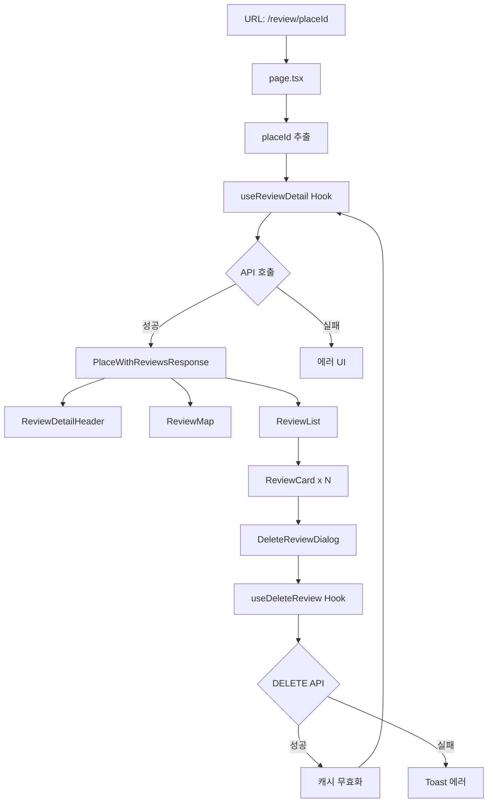

# 리뷰 조회 페이지 구현 계획

## 문서 정보

- **작성일**: 2025-10-23
- **버전**: 1.0
- **페이지명**: 리뷰 조회 페이지
- **경로**: `/review/[placeId]`
- **Path Parameter**: `placeId` (네이버 장소 ID)
- **관련 유스케이스**: UC-003 (리뷰 조회), UC-004 (리뷰 삭제)

---

## 1. 개요

### 1.1 페이지 목적

특정 맛집의 상세 정보와 해당 맛집에 작성된 모든 리뷰를 조회하여 사용자가 방문 결정에 필요한 정보를 제공합니다. 또한 리뷰 삭제 기능을 포함합니다.

### 1.2 핵심 기능

1. **맛집 정보 표시**: 이름, 주소, 위치 지도
2. **리뷰 목록 조회**: 최신순 정렬
3. **리뷰 삭제**: 확인 다이얼로그 + 삭제 처리
4. **네이버 지도 연동**: 맛집 위치 마커 표시

### 1.3 사전 구현 완료 항목 (공통 모듈)

**Backend API** (이미 구현됨):
- `GET /api/reviews?naverPlaceId={placeId}`: 맛집 정보 + 리뷰 목록 조회
- `DELETE /api/reviews/:id`: 리뷰 삭제

**공통 타입 및 스키마**:
- `src/features/reviews/lib/dto.ts`: `PlaceWithReviewsResponse`, `ReviewResponse`
- `src/lib/utils/date.ts`: 날짜 포맷 유틸리티
- `src/lib/utils/text.ts`: 텍스트 말줄임 유틸리티

**shadcn-ui 컴포넌트**:
- `dialog` (AlertDialog): 삭제 확인 다이얼로그
- `skeleton`: 로딩 상태
- `toast`: 삭제 성공/실패 알림

---

## 2. 파일 구조

### 2.1 전체 디렉토리 구조

```
src/app/review/[placeId]/
├── page.tsx                     # 메인 페이지 컴포넌트 (Server Component)
└── components/
    ├── ReviewDetailHeader.tsx   # 맛집 정보 헤더
    ├── ReviewMap.tsx            # 네이버 지도 + 마커
    ├── ReviewList.tsx           # 리뷰 목록 컨테이너
    ├── ReviewCard.tsx           # 개별 리뷰 카드
    ├── DeleteReviewDialog.tsx   # 삭제 확인 다이얼로그
    ├── EmptyReviewState.tsx     # 빈 리뷰 상태 UI
    └── ReviewSkeleton.tsx       # 로딩 스켈레톤

src/features/review-detail/
├── hooks/
│   ├── useReviewDetail.ts       # 리뷰 조회 React Query 훅
│   └── useDeleteReview.ts       # 리뷰 삭제 React Query 훅
└── lib/
    └── types.ts                 # 페이지 전용 타입 (필요 시)
```

### 2.2 파일 역할 정의

| 파일명 | 역할 | 의존성 |
|-------|------|--------|
| `page.tsx` | URL 파라미터 추출, 메타데이터 설정, 컴포넌트 조합 | - |
| `ReviewDetailHeader.tsx` | 맛집 이름, 주소, 리뷰 개수 표시 | place 데이터 |
| `ReviewMap.tsx` | 네이버 지도 SDK로 지도 + 마커 렌더링 | place 좌표 |
| `ReviewList.tsx` | 리뷰 배열을 받아 ReviewCard 렌더링 | reviews 배열 |
| `ReviewCard.tsx` | 개별 리뷰 UI + 삭제 버튼 | review 객체, onDelete 콜백 |
| `DeleteReviewDialog.tsx` | AlertDialog로 삭제 확인 | reviewId, onConfirm |
| `EmptyReviewState.tsx` | 리뷰가 없을 때 표시 | - |
| `ReviewSkeleton.tsx` | 로딩 중 스켈레톤 UI | - |
| `useReviewDetail.ts` | GET /api/reviews React Query | placeId |
| `useDeleteReview.ts` | DELETE /api/reviews/:id Mutation | - |

---

## 3. 데이터 흐름

### 3.1 데이터 플로우 다이어그램



### 3.2 상태 관리 전략

**서버 상태** (React Query):
- `queryKey`: `['reviews', placeId]`
- `queryFn`: `GET /api/reviews?naverPlaceId=${placeId}`
- `staleTime`: 30초 (리뷰는 자주 변경되지 않음)
- `cacheTime`: 5분

**클라이언트 상태** (로컬 state):
- `isDeleteDialogOpen`: boolean (다이얼로그 표시 여부)
- `selectedReviewId`: string | null (삭제 대상 리뷰 ID)

**전역 상태**: 없음 (Zustand 불필요)

---

## 4. 단계별 구현 계획

### 4.1 Phase 1: 페이지 기본 구조 + API 연동

#### 4.1.1 페이지 컴포넌트 (`page.tsx`)

**목적**: URL 파라미터 추출, 메타데이터 설정

```typescript
// src/app/review/[placeId]/page.tsx
'use client';

import { use } from 'react';
import { useParams } from 'next/navigation';
import ReviewDetailContainer from './components/ReviewDetailContainer';

type PageProps = {
  params: Promise<{ placeId: string }>;
};

export default function ReviewDetailPage({ params }: PageProps) {
  const resolvedParams = use(params);
  const { placeId } = resolvedParams;

  return <ReviewDetailContainer placeId={placeId} />;
}
```

**설계 고려사항**:
- Next.js 16의 Promise 기반 params 사용
- Client Component로 설정 (`'use client'`)
- 실제 로직은 Container 컴포넌트로 분리

#### 4.1.2 React Query 훅 (`useReviewDetail.ts`)

**위치**: `src/features/review-detail/hooks/useReviewDetail.ts`

```typescript
import { useQuery } from '@tanstack/react-query';
import type { PlaceWithReviewsResponse } from '@/features/reviews/lib/dto';
import { apiClient } from '@/lib/remote/api-client';

export const useReviewDetail = (placeId: string) => {
  return useQuery<PlaceWithReviewsResponse>({
    queryKey: ['reviews', placeId],
    queryFn: async () => {
      const response = await apiClient.get(`/reviews?naverPlaceId=${placeId}`);
      if (!response.success) {
        throw new Error(response.error?.message || 'Failed to fetch reviews');
      }
      return response.data;
    },
    staleTime: 30 * 1000, // 30초
    cacheTime: 5 * 60 * 1000, // 5분
    retry: 3,
  });
};
```

**에러 처리**:
- 404: 맛집 없음 → 에러 페이지
- 500: 서버 오류 → 재시도 버튼 표시
- 네트워크 오류: 자동 재시도 (최대 3회)

### 4.2 Phase 2: 맡집 정보 섹션

#### 4.2.1 맛집 헤더 컴포넌트 (`ReviewDetailHeader.tsx`)

**위치**: `src/app/review/[placeId]/components/ReviewDetailHeader.tsx`

**UI 구성**:
```
┌─────────────────────────────────┐
│  맛집명 (h1, 굵게)               │
│  주소 (작은 텍스트, 회색)         │
│  리뷰 개수 (badge)               │
└─────────────────────────────────┘
```

**Props**:
```typescript
type ReviewDetailHeaderProps = {
  placeName: string;
  address: string;
  reviewCount: number;
};
```

**구현 예시**:
```tsx
import { Badge } from '@/components/ui/badge';

export default function ReviewDetailHeader({
  placeName,
  address,
  reviewCount,
}: ReviewDetailHeaderProps) {
  return (
    <div className="mb-6">
      <h1 className="text-3xl font-bold mb-2">{placeName}</h1>
      <p className="text-sm text-muted-foreground mb-2">{address}</p>
      <Badge variant="secondary">리뷰 {reviewCount}개</Badge>
    </div>
  );
}
```

### 4.3 Phase 3: 네이버 지도 연동

#### 4.3.1 지도 컴포넌트 (`ReviewMap.tsx`)

**위치**: `src/app/review/[placeId]/components/ReviewMap.tsx`

**주요 기능**:
- 네이버 지도 SDK 초기화
- 맛집 위치에 마커 표시
- InfoWindow로 맛집 이름 표시 (선택적)

**Props**:
```typescript
type ReviewMapProps = {
  placeName: string;
  latitude: number;
  longitude: number;
};
```

**구현 세부사항**:

1. **지도 SDK 로딩**:
```tsx
'use client';

import { useEffect, useRef, useState } from 'react';
import Script from 'next/script';

export default function ReviewMap({ placeName, latitude, longitude }: ReviewMapProps) {
  const mapRef = useRef<HTMLDivElement>(null);
  const [isMapLoaded, setIsMapLoaded] = useState(false);

  const initMap = () => {
    if (!mapRef.current || !window.naver) return;

    const map = new window.naver.maps.Map(mapRef.current, {
      center: new window.naver.maps.LatLng(latitude, longitude),
      zoom: 15,
      zoomControl: true,
      mapTypeControl: false,
    });

    const marker = new window.naver.maps.Marker({
      position: new window.naver.maps.LatLng(latitude, longitude),
      map: map,
      title: placeName,
    });

    // (선택적) InfoWindow
    const infoWindow = new window.naver.maps.InfoWindow({
      content: `<div style="padding:10px; min-width:150px;">${placeName}</div>`,
    });
    infoWindow.open(map, marker);
  };

  useEffect(() => {
    if (isMapLoaded) {
      initMap();
    }
  }, [isMapLoaded, latitude, longitude]);

  return (
    <>
      <Script
        src={`https://openapi.map.naver.com/openapi/v3/maps.js?ncpKeyId=${process.env.NEXT_PUBLIC_NCP_CLIENT_ID}`}
        strategy="afterInteractive"
        onLoad={() => setIsMapLoaded(true)}
      />
      <div
        ref={mapRef}
        className="w-full h-[300px] md:h-[400px] rounded-lg border"
        aria-label="맛집 위치 지도"
      />
    </>
  );
}
```

2. **에러 처리**:
- 지도 로딩 실패 시 대체 메시지 표시
- `window.naver` 객체 존재 확인

3. **타입 정의** (필요 시):
```typescript
// src/lib/types/naver-maps.d.ts
declare global {
  interface Window {
    naver: any;
  }
}
```

**NCP 콘솔 설정**:
- Web service URL에 `localhost:3000`, Vercel 프리뷰/프로덕션 도메인 등록 필수

### 4.4 Phase 4: 리뷰 목록 표시

#### 4.4.1 리뷰 목록 컨테이너 (`ReviewList.tsx`)

**위치**: `src/app/review/[placeId]/components/ReviewList.tsx`

```typescript
import ReviewCard from './ReviewCard';
import EmptyReviewState from './EmptyReviewState';
import type { ReviewResponse } from '@/features/reviews/lib/dto';

type ReviewListProps = {
  reviews: ReviewResponse[];
  onDeleteReview: (reviewId: string) => void;
};

export default function ReviewList({ reviews, onDeleteReview }: ReviewListProps) {
  if (reviews.length === 0) {
    return <EmptyReviewState />;
  }

  return (
    <div className="space-y-4">
      {reviews.map((review) => (
        <ReviewCard key={review.id} review={review} onDelete={onDeleteReview} />
      ))}
    </div>
  );
}
```

#### 4.4.2 리뷰 카드 (`ReviewCard.tsx`)

**위치**: `src/app/review/[placeId]/components/ReviewCard.tsx`

**UI 구성**:
```
┌─────────────────────────────────────┐
│ 리뷰 제목 (h3, 굵게)        [삭제 버튼] │
│ 리뷰 내용 (본문)                     │
│ 작성일 (상대 시간, 작게)              │
└─────────────────────────────────────┘
```

**Props**:
```typescript
import type { ReviewResponse } from '@/features/reviews/lib/dto';

type ReviewCardProps = {
  review: ReviewResponse;
  onDelete: (reviewId: string) => void;
};
```

**구현**:
```tsx
import { Card, CardHeader, CardTitle, CardDescription, CardContent } from '@/components/ui/card';
import { Button } from '@/components/ui/button';
import { Trash2 } from 'lucide-react';
import { formatRelativeTime } from '@/lib/utils/date';

export default function ReviewCard({ review, onDelete }: ReviewCardProps) {
  return (
    <Card>
      <CardHeader className="flex flex-row items-start justify-between">
        <div className="flex-1">
          <CardTitle className="text-xl">{review.title}</CardTitle>
          <CardDescription className="text-xs mt-1">
            {formatRelativeTime(review.createdAt)}
          </CardDescription>
        </div>
        <Button
          variant="ghost"
          size="icon"
          onClick={() => onDelete(review.id)}
          aria-label="리뷰 삭제"
        >
          <Trash2 className="h-4 w-4 text-destructive" />
        </Button>
      </CardHeader>
      <CardContent>
        <p className="text-sm whitespace-pre-wrap">{review.content}</p>
      </CardContent>
    </Card>
  );
}
```

**디자인 노트**:
- `whitespace-pre-wrap`: 줄바꿈 유지
- 삭제 버튼: `ghost` variant, `icon` size

#### 4.4.3 빈 리뷰 상태 (`EmptyReviewState.tsx`)

**위치**: `src/app/review/[placeId]/components/EmptyReviewState.tsx`

```tsx
import Link from 'next/link';
import { Button } from '@/components/ui/button';
import { useParams } from 'next/navigation';

export default function EmptyReviewState() {
  const { placeId } = useParams();

  return (
    <div className="text-center py-12">
      <p className="text-muted-foreground mb-4">
        아직 리뷰가 없습니다. 첫 리뷰를 작성해보세요!
      </p>
      <Button asChild>
        <Link href={`/review/new?naverPlaceId=${placeId}`}>리뷰 작성하기</Link>
      </Button>
    </div>
  );
}
```

**참고**: `naverPlaceId` 외에 다른 파라미터(placeName, address 등)는 어떻게 전달?
→ 리뷰 작성 페이지에서 다시 맛집 조회 API 호출하거나, URL 쿼리 파라미터로 전달

### 4.5 Phase 5: 리뷰 삭제 기능

#### 4.5.1 삭제 다이얼로그 (`DeleteReviewDialog.tsx`)

**위치**: `src/app/review/[placeId]/components/DeleteReviewDialog.tsx`

```tsx
'use client';

import {
  AlertDialog,
  AlertDialogAction,
  AlertDialogCancel,
  AlertDialogContent,
  AlertDialogDescription,
  AlertDialogFooter,
  AlertDialogHeader,
  AlertDialogTitle,
} from '@/components/ui/alert-dialog';

type DeleteReviewDialogProps = {
  open: boolean;
  onOpenChange: (open: boolean) => void;
  onConfirm: () => void;
  isDeleting: boolean;
};

export default function DeleteReviewDialog({
  open,
  onOpenChange,
  onConfirm,
  isDeleting,
}: DeleteReviewDialogProps) {
  return (
    <AlertDialog open={open} onOpenChange={onOpenChange}>
      <AlertDialogContent>
        <AlertDialogHeader>
          <AlertDialogTitle>리뷰 삭제</AlertDialogTitle>
          <AlertDialogDescription>
            정말 이 리뷰를 삭제하시겠습니까? 이 작업은 되돌릴 수 없습니다.
          </AlertDialogDescription>
        </AlertDialogHeader>
        <AlertDialogFooter>
          <AlertDialogCancel disabled={isDeleting}>취소</AlertDialogCancel>
          <AlertDialogAction
            onClick={onConfirm}
            disabled={isDeleting}
            className="bg-destructive text-destructive-foreground hover:bg-destructive/90"
          >
            {isDeleting ? '삭제 중...' : '삭제'}
          </AlertDialogAction>
        </AlertDialogFooter>
      </AlertDialogContent>
    </AlertDialog>
  );
}
```

#### 4.5.2 삭제 Mutation 훅 (`useDeleteReview.ts`)

**위치**: `src/features/review-detail/hooks/useDeleteReview.ts`

```typescript
import { useMutation, useQueryClient } from '@tanstack/react-query';
import { apiClient } from '@/lib/remote/api-client';
import { toast } from '@/components/ui/use-toast';

export const useDeleteReview = (placeId: string) => {
  const queryClient = useQueryClient();

  return useMutation({
    mutationFn: async (reviewId: string) => {
      const response = await apiClient.delete(`/reviews/${reviewId}`);
      if (!response.success) {
        throw new Error(response.error?.message || '삭제에 실패했습니다');
      }
      return response.data;
    },
    onSuccess: () => {
      // 캐시 무효화 및 재조회
      queryClient.invalidateQueries({ queryKey: ['reviews', placeId] });
      queryClient.invalidateQueries({ queryKey: ['places', 'with-reviews'] }); // 메인 페이지 캐시도 무효화
      toast({
        title: '리뷰가 삭제되었습니다',
        variant: 'default',
      });
    },
    onError: (error) => {
      toast({
        title: '삭제 실패',
        description: error.message || '리뷰 삭제 중 오류가 발생했습니다',
        variant: 'destructive',
      });
    },
  });
};
```

**에러 처리**:
- 404: "이미 삭제된 리뷰입니다"
- 500: "삭제 중 오류가 발생했습니다"
- 네트워크 오류: "네트워크 연결을 확인해주세요"

#### 4.5.3 컨테이너에서 삭제 로직 통합

**위치**: `src/app/review/[placeId]/components/ReviewDetailContainer.tsx`

```tsx
'use client';

import { useState } from 'react';
import { useReviewDetail } from '@/features/review-detail/hooks/useReviewDetail';
import { useDeleteReview } from '@/features/review-detail/hooks/useDeleteReview';
import ReviewDetailHeader from './ReviewDetailHeader';
import ReviewMap from './ReviewMap';
import ReviewList from './ReviewList';
import DeleteReviewDialog from './DeleteReviewDialog';
import ReviewSkeleton from './ReviewSkeleton';

type ReviewDetailContainerProps = {
  placeId: string;
};

export default function ReviewDetailContainer({ placeId }: ReviewDetailContainerProps) {
  const { data, isLoading, error } = useReviewDetail(placeId);
  const deleteMutation = useDeleteReview(placeId);
  const [deleteDialogOpen, setDeleteDialogOpen] = useState(false);
  const [selectedReviewId, setSelectedReviewId] = useState<string | null>(null);

  const handleDeleteClick = (reviewId: string) => {
    setSelectedReviewId(reviewId);
    setDeleteDialogOpen(true);
  };

  const handleConfirmDelete = () => {
    if (selectedReviewId) {
      deleteMutation.mutate(selectedReviewId, {
        onSuccess: () => {
          setDeleteDialogOpen(false);
          setSelectedReviewId(null);
        },
      });
    }
  };

  if (isLoading) {
    return <ReviewSkeleton />;
  }

  if (error || !data) {
    return (
      <div className="text-center py-12">
        <p className="text-destructive">맛집 정보를 불러올 수 없습니다.</p>
      </div>
    );
  }

  const { place, reviews } = data;

  return (
    <div className="container mx-auto px-4 py-8 max-w-4xl">
      <ReviewDetailHeader
        placeName={place.name}
        address={place.address}
        reviewCount={reviews.length}
      />

      <div className="mb-8">
        <ReviewMap
          placeName={place.name}
          latitude={place.latitude}
          longitude={place.longitude}
        />
      </div>

      <ReviewList reviews={reviews} onDeleteReview={handleDeleteClick} />

      <DeleteReviewDialog
        open={deleteDialogOpen}
        onOpenChange={setDeleteDialogOpen}
        onConfirm={handleConfirmDelete}
        isDeleting={deleteMutation.isPending}
      />
    </div>
  );
}
```

### 4.6 Phase 6: 로딩 및 에러 처리

#### 4.6.1 로딩 스켈레톤 (`ReviewSkeleton.tsx`)

**위치**: `src/app/review/[placeId]/components/ReviewSkeleton.tsx`

```tsx
import { Skeleton } from '@/components/ui/skeleton';
import { Card, CardHeader, CardContent } from '@/components/ui/card';

export default function ReviewSkeleton() {
  return (
    <div className="container mx-auto px-4 py-8 max-w-4xl">
      {/* 헤더 스켈레톤 */}
      <div className="mb-6">
        <Skeleton className="h-10 w-64 mb-2" />
        <Skeleton className="h-4 w-96 mb-2" />
        <Skeleton className="h-6 w-20" />
      </div>

      {/* 지도 스켈레톤 */}
      <Skeleton className="w-full h-[300px] md:h-[400px] rounded-lg mb-8" />

      {/* 리뷰 카드 스켈레톤 */}
      <div className="space-y-4">
        {[1, 2, 3].map((i) => (
          <Card key={i}>
            <CardHeader>
              <Skeleton className="h-6 w-48" />
              <Skeleton className="h-3 w-24" />
            </CardHeader>
            <CardContent>
              <Skeleton className="h-4 w-full mb-2" />
              <Skeleton className="h-4 w-5/6" />
            </CardContent>
          </Card>
        ))}
      </div>
    </div>
  );
}
```

#### 4.6.2 에러 바운더리 (선택 사항)

Next.js 16의 `error.tsx` 활용:

**위치**: `src/app/review/[placeId]/error.tsx`

```tsx
'use client';

import { useEffect } from 'react';
import { Button } from '@/components/ui/button';

export default function Error({
  error,
  reset,
}: {
  error: Error & { digest?: string };
  reset: () => void;
}) {
  useEffect(() => {
    console.error('Review detail page error:', error);
  }, [error]);

  return (
    <div className="container mx-auto px-4 py-12 text-center">
      <h2 className="text-2xl font-bold mb-4">문제가 발생했습니다</h2>
      <p className="text-muted-foreground mb-6">
        페이지를 불러오는 중 오류가 발생했습니다.
      </p>
      <Button onClick={reset}>다시 시도</Button>
    </div>
  );
}
```

---

## 5. API 연동 세부사항

### 5.1 리뷰 조회 API

**Endpoint**: `GET /api/reviews?naverPlaceId={placeId}`

**응답 타입** (이미 정의됨):
```typescript
// src/features/reviews/lib/dto.ts
export type PlaceWithReviewsResponse = {
  place: {
    id: string;
    naverPlaceId: string;
    name: string;
    address: string;
    latitude: number;
    longitude: number;
  };
  reviews: ReviewResponse[];
};

export type ReviewResponse = {
  id: string;
  placeId: string;
  title: string;
  content: string;
  createdAt: string;
  updatedAt: string;
};
```

**에러 응답**:
- `404`: `PLACE_NOT_FOUND` (맛집 없음)
- `500`: `REVIEW_FETCH_ERROR` (서버 오류)

### 5.2 리뷰 삭제 API

**Endpoint**: `DELETE /api/reviews/:id`

**응답**:
```json
{
  "success": true,
  "message": "리뷰가 삭제되었습니다"
}
```

**에러 응답**:
- `404`: `REVIEW_NOT_FOUND` (리뷰 없음)
- `500`: `REVIEW_DELETE_ERROR` (삭제 실패)

---

## 6. 네이버 지도 연동 세부사항

### 6.1 SDK 로딩 전략

**방법**: `next/script`의 `afterInteractive` 전략 사용

```tsx
<Script
  src={`https://openapi.map.naver.com/openapi/v3/maps.js?ncpKeyId=${process.env.NEXT_PUBLIC_NCP_CLIENT_ID}`}
  strategy="afterInteractive"
  onLoad={() => setIsMapLoaded(true)}
/>
```

**이유**:
- `beforeInteractive`: 너무 빠름 (DOM 준비 전)
- `afterInteractive`: 페이지 인터랙티브 후 로딩 (권장)
- `lazyOnload`: 너무 늦음 (지도 표시 지연)

### 6.2 환경변수 설정

**.env.local**:
```env
NEXT_PUBLIC_NCP_CLIENT_ID=your_ncp_client_id_here
```

**NCP 콘솔 설정**:
1. NCP 콘솔 → AI·NAVER API → Application
2. Maps 앱 생성 → Client ID 발급
3. Web service URL 등록:
   - `http://localhost:3000`
   - Vercel 프리뷰: `https://*.vercel.app`
   - 프로덕션: `https://yourdomain.com`

### 6.3 지도 옵션

```javascript
{
  center: new naver.maps.LatLng(latitude, longitude),
  zoom: 15, // 상세 페이지는 확대
  zoomControl: true, // 확대/축소 버튼
  mapTypeControl: false, // 지도 타입 선택 숨김
}
```

### 6.4 마커 및 InfoWindow

**마커**:
```javascript
const marker = new naver.maps.Marker({
  position: new naver.maps.LatLng(latitude, longitude),
  map: map,
  title: placeName,
});
```

**InfoWindow** (선택적):
```javascript
const infoWindow = new naver.maps.InfoWindow({
  content: `<div style="padding:10px; min-width:150px;">${placeName}</div>`,
});
infoWindow.open(map, marker);
```

### 6.5 타입 정의

**위치**: `src/lib/types/naver-maps.d.ts` (신규 생성)

```typescript
declare global {
  interface Window {
    naver: any;
  }
}

export {};
```

---

## 7. 스타일링 가이드

### 7.1 Tailwind CSS 클래스 사용

**컨테이너**:
```tsx
<div className="container mx-auto px-4 py-8 max-w-4xl">
```

**반응형 지도**:
```tsx
<div className="w-full h-[300px] md:h-[400px] rounded-lg border">
```

**리뷰 카드 간격**:
```tsx
<div className="space-y-4">
```

**삭제 버튼**:
```tsx
<Button variant="ghost" size="icon">
  <Trash2 className="h-4 w-4 text-destructive" />
</Button>
```

### 7.2 shadcn-ui 컴포넌트 사용

- `Card`, `CardHeader`, `CardTitle`, `CardContent`: 리뷰 카드
- `AlertDialog`: 삭제 확인 다이얼로그
- `Skeleton`: 로딩 스켈레톤
- `Badge`: 리뷰 개수 표시
- `Button`: 삭제 버튼, 리뷰 작성 버튼
- `Toast`: 삭제 성공/실패 알림

---

## 8. 테스트 시나리오

### 8.1 기능 테스트

| 테스트 케이스 ID | 입력 | 기대 결과 |
|----------------|------|----------|
| TC-RV-01 | 유효한 placeId (리뷰 3개) | 맛집 정보 + 지도 + 3개 리뷰 표시 |
| TC-RV-02 | 유효한 placeId (리뷰 1개) | 맛집 정보 + 지도 + 1개 리뷰 표시 |
| TC-RV-03 | 유효한 placeId (리뷰 0개) | 맛집 정보 + 지도 + 빈 상태 UI |
| TC-RV-04 | 존재하지 않는 placeId | "맛집 정보를 불러올 수 없습니다" 에러 |
| TC-RV-05 | 삭제 버튼 클릭 | 확인 다이얼로그 표시 |
| TC-RV-06 | 삭제 확인 | 리뷰 삭제 + Toast 알림 + 목록 갱신 |
| TC-RV-07 | 삭제 취소 | 다이얼로그 닫힘, 리뷰 유지 |
| TC-RV-08 | 마지막 리뷰 삭제 | 빈 상태 UI 표시 |

### 8.2 에러 케이스 테스트

| 테스트 케이스 ID | 시나리오 | 기대 결과 |
|----------------|----------|----------|
| TC-RV-E01 | 네트워크 오류 (리뷰 조회) | 로딩 실패 → 재시도 버튼 |
| TC-RV-E02 | 네트워크 오류 (리뷰 삭제) | Toast: "삭제 실패" + 재시도 옵션 |
| TC-RV-E03 | 이미 삭제된 리뷰 삭제 시도 | Toast: "이미 삭제된 리뷰입니다" |
| TC-RV-E04 | 지도 SDK 로딩 실패 | 지도 영역에 오류 메시지, 나머지는 정상 |

### 8.3 성능 테스트

| 항목 | 목표 | 측정 방법 |
|-----|------|----------|
| 초기 페이지 로딩 (FCP) | < 2초 | Lighthouse |
| API 응답 시간 | < 500ms | Network 탭 |
| 지도 렌더링 시간 | < 1초 | Performance API |
| 리뷰 삭제 완료 시간 | < 1초 | 사용자 체감 시간 |

---

## 9. 접근성 (Accessibility)

### 9.1 ARIA 속성

**지도**:
```tsx
<div ref={mapRef} aria-label="맛집 위치 지도" />
```

**삭제 버튼**:
```tsx
<Button aria-label="리뷰 삭제">
  <Trash2 />
</Button>
```

### 9.2 키보드 네비게이션

- Tab 키로 삭제 버튼 접근 가능
- Enter/Space로 삭제 다이얼로그 열기
- 다이얼로그에서 Tab/Shift+Tab으로 버튼 간 이동

### 9.3 스크린 리더

- 리뷰 개수: "리뷰 3개"
- 작성일: "2시간 전"
- 삭제 버튼: "리뷰 삭제"

---

## 10. 성능 최적화

### 10.1 React Query 캐싱

- `staleTime: 30초`: 30초 동안은 재요청 안 함
- `cacheTime: 5분`: 캐시 보관 시간
- `retry: 3`: 네트워크 오류 시 3회 재시도

### 10.2 컴포넌트 최적화

**불필요한 리렌더링 방지**:
```tsx
import { memo } from 'react';

const ReviewCard = memo(({ review, onDelete }: ReviewCardProps) => {
  // ...
});
```

**지도 재렌더링 방지**:
```tsx
useEffect(() => {
  if (isMapLoaded) {
    initMap();
  }
}, [isMapLoaded]); // latitude, longitude 변경 시에만 재초기화
```

### 10.3 이미지 최적화 (향후)

Phase 5에서 이미지 추가 시 `next/image` 사용:
```tsx
import Image from 'next/image';

<Image
  src={review.imageUrl}
  alt={review.title}
  width={400}
  height={300}
  className="rounded-lg"
  loading="lazy"
/>
```

---

## 11. 보안 고려사항

### 11.1 XSS 방지

- React는 기본적으로 HTML 이스케이프 제공
- 리뷰 내용은 `whitespace-pre-wrap`으로 표시하되 HTML 태그는 렌더링 안 됨

### 11.2 네이버 지도 API 키 보호

- `NEXT_PUBLIC_NCP_CLIENT_ID`는 클라이언트 노출 허용
- 도메인 검증(Referer)으로 무단 사용 방지
- NCP 콘솔에서 허용 도메인 관리

### 11.3 SQL Injection 방지

- Supabase 파라미터 바인딩 사용 (백엔드에서 처리됨)

---

## 12. 배포 전 체크리스트

### 12.1 환경변수 확인

- [ ] `.env.local`에 `NEXT_PUBLIC_NCP_CLIENT_ID` 설정
- [ ] Vercel 프로젝트에 환경변수 등록
- [ ] NCP 콘솔에 프로덕션 도메인 등록

### 12.2 API 테스트

- [ ] `GET /api/reviews?naverPlaceId=xxx` 정상 응답 확인
- [ ] `DELETE /api/reviews/:id` 정상 응답 확인
- [ ] 404, 500 에러 응답 확인

### 12.3 UI/UX 검증

- [ ] 로딩 스켈레톤 표시 확인
- [ ] 빈 리뷰 상태 UI 확인
- [ ] 삭제 다이얼로그 동작 확인
- [ ] Toast 알림 표시 확인
- [ ] 반응형 디자인 (모바일/태블릿/데스크톱)

### 12.4 접근성 테스트

- [ ] 키보드 네비게이션 (Tab, Enter, Escape)
- [ ] 스크린 리더 테스트 (NVDA/VoiceOver)
- [ ] ARIA 속성 확인

### 12.5 성능 테스트

- [ ] Lighthouse 점수 > 90
- [ ] FCP < 2초
- [ ] API 응답 시간 < 500ms

---

## 13. 향후 개선 사항 (Out of Scope)

### 13.1 Phase 4: 사용자 인증 도입

- 본인이 작성한 리뷰만 삭제 버튼 표시
- 작성자 이름 표시

### 13.2 Phase 5: 평점 및 이미지

- 평점 (별점) 표시
- 리뷰 이미지 표시 및 라이트박스
- 평균 평점 계산

### 13.3 Phase 6: 고도화

- 리뷰 정렬 옵션 (최신순/평점순)
- 무한 스크롤 (페이지네이션)
- 리뷰 검색 기능

---

## 14. 관련 문서

- [PRD 문서](../../prd.md)
- [User Flow 문서](../../userflow.md) - 플로우 3, 4
- [Database 설계](../../database.md)
- [공통 모듈 문서](../../common-modules.md)
- [UC-003: 리뷰 조회](../../usecases/3-review-view/spec.md)
- [UC-004: 리뷰 삭제](../../usecases/4-review-delete/spec.md)
- [Naver Maps JavaScript API v3 공식 문서](https://navermaps.github.io/maps.js.ncp/)

---

## 15. 변경 이력

| 버전 | 날짜 | 작성자 | 변경 내용 |
|------|------|--------|-----------|
| 1.0  | 2025-10-23 | Claude | 초기 작성 |

---

## 부록

### A. 파일 생성 순서 (구현 시 참고)

1. **Phase 1**: 페이지 기본 구조
   - [ ] `src/app/review/[placeId]/page.tsx`
   - [ ] `src/features/review-detail/hooks/useReviewDetail.ts`
   - [ ] `src/app/review/[placeId]/components/ReviewDetailContainer.tsx`

2. **Phase 2**: 맛집 정보 섹션
   - [ ] `src/app/review/[placeId]/components/ReviewDetailHeader.tsx`

3. **Phase 3**: 네이버 지도
   - [ ] `src/lib/types/naver-maps.d.ts`
   - [ ] `src/app/review/[placeId]/components/ReviewMap.tsx`

4. **Phase 4**: 리뷰 목록
   - [ ] `src/app/review/[placeId]/components/ReviewList.tsx`
   - [ ] `src/app/review/[placeId]/components/ReviewCard.tsx`
   - [ ] `src/app/review/[placeId]/components/EmptyReviewState.tsx`

5. **Phase 5**: 리뷰 삭제
   - [ ] `src/features/review-detail/hooks/useDeleteReview.ts`
   - [ ] `src/app/review/[placeId]/components/DeleteReviewDialog.tsx`

6. **Phase 6**: 로딩/에러 처리
   - [ ] `src/app/review/[placeId]/components/ReviewSkeleton.tsx`
   - [ ] `src/app/review/[placeId]/error.tsx`

### B. shadcn-ui 컴포넌트 확인

이미 설치된 컴포넌트 (공통 모듈 작업 시 설치됨):
- [x] `dialog` (AlertDialog)
- [x] `skeleton`
- [x] `toast`
- [x] `card`
- [x] `button`
- [x] `badge`

### C. 환경변수 템플릿

**.env.local**:
```env
# 네이버 지도 SDK용 (클라이언트 공개)
NEXT_PUBLIC_NCP_CLIENT_ID=your_ncp_client_id_here

# API 베이스 URL (선택, 기본값: /api)
NEXT_PUBLIC_API_BASE_URL=/api
```

**Vercel 환경변수**:
- `NEXT_PUBLIC_NCP_CLIENT_ID`: 프로덕션 Client ID
- `NEXT_PUBLIC_API_BASE_URL`: `/api` (기본값)

### D. NCP 도메인 등록 예시

**NCP 콘솔 → Application → Web service URL**:
```
http://localhost:3000
https://your-app.vercel.app
https://*.vercel.app
https://yourdomain.com
```

**참고**: 와일드카드(`*.vercel.app`)는 Vercel 프리뷰 URL에 대응

---

**문서 승인**:
- [ ] Tech Lead
- [ ] Frontend Developer
- [ ] Backend Developer

---

**다음 단계**:
1. 공통 모듈 작업 완료 확인
2. 환경변수 설정 확인
3. Phase 1부터 순차적으로 구현 시작
4. 각 Phase 완료 후 테스트
5. PR 생성 및 리뷰 요청

---

**문의**: 프로젝트 관련 문의는 GitHub Issues 또는 팀 채널 활용
