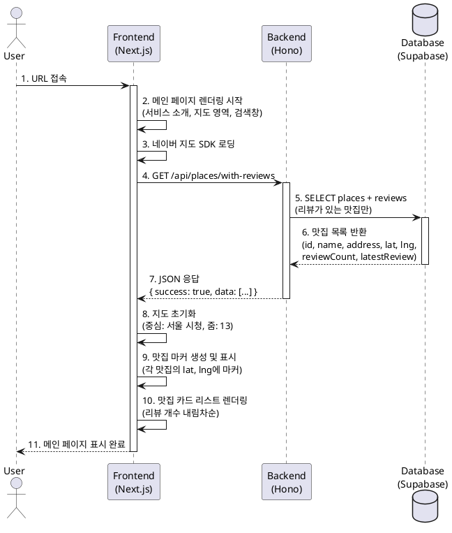

# 유스케이스: 메인 페이지 접속 및 탐색

## 유스케이스 ID: UC-001

### 제목
메인 페이지 접속 및 리뷰가 등록된 맛집 탐색

---

## 1. 개요

### 1.1 목적
사용자가 애플리케이션에 처음 접속하여 서비스 개요를 파악하고, 지도 기반으로 리뷰가 등록된 맛집을 시각적으로 탐색할 수 있도록 한다.

### 1.2 범위
- 메인 페이지 렌더링 (서비스 소개, 지도, 맛집 카드 리스트, 검색창)
- 리뷰가 있는 맛집 목록 조회 및 표시
- 지도에 맛집 마커 표시
- 검색창 UI 제공

**제외 범위**:
- 음식점 검색 실행 (별도 유스케이스)
- 리뷰 상세 조회 (별도 유스케이스)

### 1.3 액터
- **주요 액터**: 일반 사용자 (비로그인)
- **부 액터**: 없음

---

## 2. 선행 조건

- 사용자가 인터넷에 연결되어 있음
- 브라우저가 JavaScript를 지원함

---

## 3. 참여 컴포넌트

- **Frontend (Next.js)**: 메인 페이지 렌더링, 네이버 지도 SDK 로딩
- **Backend (Hono)**: 리뷰가 있는 맛집 목록 API 제공 (`GET /api/places/with-reviews`)
- **Database (Supabase)**: `places`, `reviews` 테이블 조회
- **Naver Maps JavaScript API v3 (SDK)**: 지도 렌더링 및 마커 표시
  - 공식 문서: https://navermaps.github.io/maps.js.ncp/
  - 로딩 방식: `<script>` 태그 또는 Next.js `next/script` 컴포넌트
  - 인증: `ncpKeyId` (NEXT_PUBLIC_NCP_CLIENT_ID)
  - 서브모듈: `geocoder` (선택적, 주소↔좌표 변환 시 필요)

---

## 4. 기본 플로우 (Basic Flow)

### 4.1 단계별 흐름

1. **사용자**: 브라우저에서 애플리케이션 URL 접속
   - 입력: URL 입력
   - 처리: 브라우저가 메인 페이지 요청
   - 출력: HTTP GET 요청

2. **Frontend**: 메인 페이지 SSR/CSR 렌더링
   - 입력: 사용자 요청
   - 처리:
     - 페이지 컴포넌트 로딩 (`"use client"` 선언 필수)
     - 네이버 지도 SDK 스크립트 로딩 (`next/script`의 `afterInteractive` 전략 사용)
     - 스크립트 URL: `https://oapi.map.naver.com/openapi/v3/maps.js?ncpKeyId={NEXT_PUBLIC_NCP_CLIENT_ID}&submodules=geocoder`
   - 출력: 기본 레이아웃 표시 (서비스 소개, 지도 영역, 검색창)

3. **Frontend**: 리뷰가 있는 맛집 목록 요청
   - 입력: 없음
   - 처리: `GET /api/places/with-reviews` API 호출 (React Query)
   - 출력: HTTP 요청

4. **Backend**: 맛집 목록 조회 쿼리 실행
   - 입력: API 요청
   - 처리: Supabase 클라이언트로 데이터 조회
   - 출력: SQL 쿼리

5. **Database**: 맛집 및 리뷰 데이터 반환
   - 입력: SQL 쿼리
   ```sql
   SELECT
     p.id, p.naver_place_id, p.name, p.address,
     p.latitude, p.longitude,
     COUNT(r.id) AS review_count,
     (SELECT r2.content FROM reviews r2
      WHERE r2.place_id = p.id
      ORDER BY r2.created_at DESC LIMIT 1
     ) AS latest_review_preview
   FROM places p
   INNER JOIN reviews r ON p.id = r.place_id
   GROUP BY p.id
   HAVING COUNT(r.id) > 0
   ORDER BY COUNT(r.id) DESC;
   ```
   - 처리: 쿼리 실행
   - 출력: 맛집 목록 JSON

6. **Backend**: API 응답 반환
   - 입력: DB 쿼리 결과
   - 처리: Zod 스키마 검증 및 응답 포맷팅
   - 출력: JSON 응답
   ```json
   {
     "success": true,
     "data": [
       {
         "id": "uuid",
         "naverPlaceId": "xxx",
         "name": "맛있는 식당",
         "address": "서울특별시...",
         "latitude": 37.5665,
         "longitude": 126.9780,
         "reviewCount": 5,
         "latestReview": {
           "content": "파스타가 정말..."
         }
       }
     ]
   }
   ```

7. **Frontend**: 지도 렌더링 및 마커 표시
   - 입력: 맛집 목록 데이터
   - 처리:
     - `window.naver` 객체 존재 확인 (SDK 로드 완료 여부)
     - 네이버 지도 API 초기화:
       ```js
       const map = new naver.maps.Map('map', {
         center: new naver.maps.LatLng(37.5665, 126.9780), // 서울 시청
         zoom: 13
       });
       ```
     - 각 맛집 위치에 마커 생성:
       ```js
       new naver.maps.Marker({
         position: new naver.maps.LatLng(place.latitude, place.longitude),
         map: map,
         title: place.name
       });
       ```
     - 마커에 클릭 이벤트 연결 (리뷰 조회 페이지 이동)
   - 출력: 지도 및 마커 렌더링
   - **참고**: 도메인 검증(Referer)을 위해 NCP 콘솔에서 Web service URL 등록 필수

8. **Frontend**: 맛집 카드 리스트 렌더링
   - 입력: 맛집 목록 데이터
   - 처리: 리뷰 개수 내림차순 정렬, 카드 컴포넌트 생성
   - 출력: 맛집 카드 목록 표시
     - 맛집명, 주소, 리뷰 개수, 최근 리뷰 미리보기 (1줄 말줄임)

9. **사용자**: 메인 페이지 콘텐츠 확인 완료
   - 출력: 서비스 소개, 지도, 맛집 카드, 검색창 모두 표시됨

### 4.2 시퀀스 다이어그램



---

## 5. 대안 플로우 (Alternative Flows)

### 5.1 대안 플로우 1: 리뷰가 등록된 맛집이 없는 경우

**시작 조건**: Database에서 리뷰가 있는 맛집이 0개 반환

**단계**:
1. Backend가 빈 배열 `[]` 반환
2. Frontend에서 맛집 카드 영역에 빈 상태 메시지 표시:
   - "아직 등록된 리뷰가 없습니다. 첫 번째 리뷰를 작성해보세요!"
3. 지도는 기본 중심 좌표(서울 시청)로 표시되고 마커는 없음
4. 검색창은 정상적으로 표시되어 사용자가 음식점 검색 가능

**결과**: 사용자는 검색을 통해 리뷰 작성 가능

---

## 6. 예외 플로우 (Exception Flows)

### 6.1 예외 상황 1: 네트워크 오류

**발생 조건**: 사용자의 네트워크가 끊기거나 서버 응답 타임아웃

**처리 방법**:
1. React Query의 `onError` 핸들러에서 오류 감지
2. 페이지 상단에 오류 메시지 표시:
   - "네트워크 오류가 발생했습니다. 인터넷 연결을 확인해주세요."
3. 새로고침 버튼 제공
4. 지도 및 검색창은 정상 표시 (API 독립적)

**에러 코드**: `NETWORK_ERROR` (클라이언트 측)

**사용자 메시지**: "네트워크 연결을 확인하고 다시 시도해주세요."

### 6.2 예외 상황 2: 네이버 지도 API 로딩 실패

**발생 조건**: 네이버 지도 SDK 스크립트 로딩 실패 (CDN 오류, API 키 문제)

**처리 방법**:
1. `window.naver` 객체 존재 여부 확인
2. 지도 영역에 대체 메시지 표시:
   - "지도를 불러올 수 없습니다. 잠시 후 다시 시도해주세요."
3. 맛집 카드 리스트 및 검색창은 정상 표시
4. 에러 로그 전송 (Sentry 등)

**에러 코드**: `MAP_LOAD_ERROR`

**사용자 메시지**: "지도 서비스를 일시적으로 사용할 수 없습니다. 목록에서 맛집을 탐색해주세요."

### 6.3 예외 상황 3: Backend API 오류 (500)

**발생 조건**: Supabase 연결 오류, 서버 내부 오류

**처리 방법**:
1. Backend에서 에러 로깅 및 500 응답 반환
2. Frontend에서 오류 메시지 표시:
   - "서버 오류가 발생했습니다. 잠시 후 다시 시도해주세요."
3. 재시도 버튼 제공 (React Query의 `refetch`)
4. 지도 및 검색창은 정상 표시

**에러 코드**: `500 Internal Server Error`

**사용자 메시지**: "일시적인 오류가 발생했습니다. 잠시 후 다시 시도해주세요."

### 6.4 예외 상황 4: Database 조회 지연

**발생 조건**: 데이터베이스 쿼리 실행이 2초 이상 소요

**처리 방법**:
1. Frontend에서 로딩 스켈레톤 UI 표시
   - 지도 영역: 회색 박스
   - 맛집 카드 영역: 스켈레톤 카드 3개
2. 타임아웃 10초 설정, 초과 시 오류 처리
3. 성공 시 정상 렌더링

**에러 코드**: `TIMEOUT_ERROR`

**사용자 메시지**: "데이터 로딩이 지연되고 있습니다. 잠시만 기다려주세요."

---

## 7. 후행 조건 (Post-conditions)

### 7.1 성공 시

- **데이터베이스 변경**: 없음 (읽기 전용)
- **시스템 상태**:
  - 메인 페이지가 완전히 렌더링됨
  - 네이버 지도가 초기화되고 마커가 표시됨
  - 맛집 카드 리스트가 표시됨
  - 사용자가 다음 액션 수행 가능 (검색, 카드 클릭, 마커 클릭)
- **외부 시스템**:
  - 네이버 지도 SDK가 로드됨
  - 지도 타일 이미지가 캐싱됨

### 7.2 실패 시

- **데이터 롤백**: 해당 없음 (읽기 전용)
- **시스템 상태**:
  - 오류 메시지가 표시된 상태로 유지
  - 부분적으로 렌더링된 UI 요소는 유지 (지도 오류 시에도 카드 리스트는 표시 가능)

---

## 8. 비즈니스 규칙 (Business Rules)

1. **리뷰가 있는 맛집만 표시**: 리뷰가 0개인 맛집은 메인 페이지에 표시하지 않음
2. **리뷰 개수 내림차순 정렬**: 맛집 카드는 리뷰 개수가 많은 순서대로 표시
3. **최신 리뷰 미리보기**: 각 맛집 카드에는 가장 최근 리뷰 1줄만 표시 (말줄임)
4. **지도 초기 중심**: 리뷰가 있는 맛집이 없을 경우 서울 시청(37.5665, 126.9780) 기준
5. **비로그인 접근**: 모든 사용자가 로그인 없이 메인 페이지 조회 가능

---

## 9. 비기능 요구사항

### 9.1 성능
- 메인 페이지 초기 로딩 시간: 2초 이내 (Lighthouse FCP 기준)
- API 응답 시간: 500ms 이내
- 지도 렌더링 시간: 1초 이내
- 맛집 100개 이하 시 마커 클러스터링 불필요

### 9.2 보안
- **네이버 지도 SDK 인증 관리**:
  - 클라이언트 ID는 브라우저 노출 허용 (`NEXT_PUBLIC_NCP_CLIENT_ID`)
  - 도메인 검증(Referer)으로 무단 사용 방지
  - NCP 콘솔에서 프로덕션/프리뷰/로컬 도메인 모두 등록 필요
  - 예시: `http://localhost:3000`, `https://yourapp.vercel.app`
- Backend API: 인증 불필요 (공개 데이터)
- SQL Injection 방지: Supabase 파라미터 바인딩 사용

### 9.3 가용성
- 네이버 지도 API 장애 시에도 맛집 카드 리스트는 정상 표시되어야 함
- Backend API 장애 시 사용자에게 재시도 옵션 제공

---

## 10. UI/UX 요구사항

### 10.1 화면 구성 (상단 → 하단)

```
┌─────────────────────────────────────┐
│  1. 서비스 소개 섹션 (Hero)          │
│     - 서비스명                       │
│     - 캐치프레이즈                   │
│     - 간단한 사용 가이드 (1-2줄)    │
├─────────────────────────────────────┤
│  2. 네이버 지도 (Interactive Map)    │
│     - 초기 중심: 서울 시청           │
│     - 줌 레벨: 13                    │
│     - 리뷰가 있는 맛집 마커 표시     │
├─────────────────────────────────────┤
│  3. 맛집 카드 리스트 (Grid/List)     │
│     각 카드:                         │
│     - 맛집 이름                      │
│     - 주소                           │
│     - 리뷰 개수                      │
│     - 최근 리뷰 미리보기 (1줄)       │
├─────────────────────────────────────┤
│  4. 음식점 검색창 (Search Bar)       │
│     - Placeholder: "음식점 검색..."  │
│     - 디바운스: 500ms                │
└─────────────────────────────────────┘
```

### 10.2 사용자 경험

- **로딩 상태**: 데이터 로딩 중 스켈레톤 UI 표시
- **빈 상태**: 리뷰가 없을 경우 친근한 안내 메시지 및 리뷰 작성 유도
- **오류 상태**: 명확한 오류 메시지 및 재시도 버튼
- **반응형**: 모바일/태블릿/데스크톱 모두 대응
- **접근성**: ARIA 레이블, 키보드 네비게이션 지원

---

## 11. 테스트 시나리오

### 11.1 성공 케이스

| 테스트 케이스 ID | 시나리오 | 기대 결과 |
|----------------|---------|----------|
| TC-001-01 | 리뷰가 있는 맛집 5개 존재 시 메인 페이지 접속 | 지도에 마커 5개 표시, 카드 리스트에 5개 카드 표시 (리뷰 개수 내림차순) |
| TC-001-02 | 네트워크 정상, API 응답 200ms | 2초 이내 메인 페이지 완전 렌더링 |
| TC-001-03 | 맛집 카드 클릭 | 해당 맛집의 리뷰 조회 페이지로 이동 |
| TC-001-04 | 지도 마커 클릭 | 인포윈도우 표시 후 "자세히 보기" 클릭 시 리뷰 조회 페이지로 이동 |

### 11.2 실패 케이스

| 테스트 케이스 ID | 시나리오 | 기대 결과 |
|----------------|---------|----------|
| TC-001-05 | 리뷰가 있는 맛집 0개 | "아직 등록된 리뷰가 없습니다" 메시지 표시, 검색창은 정상 표시 |
| TC-001-06 | Backend API 500 오류 | "서버 오류가 발생했습니다" 메시지 + 재시도 버튼 표시 |
| TC-001-07 | 네이버 지도 SDK 로딩 실패 | "지도를 불러올 수 없습니다" 메시지 표시, 맛집 카드는 정상 표시 |
| TC-001-08 | 네트워크 끊김 | "네트워크 연결을 확인해주세요" 메시지 + 새로고침 버튼 |
| TC-001-09 | API 응답 10초 초과 | 타임아웃 오류 메시지 + 재시도 버튼 |

---

## 12. 관련 유스케이스

- **후행 유스케이스**:
  - UC-002: 맛집 검색 및 리뷰 작성
  - UC-003: 맛집 리뷰 조회
  - UC-005: 지도 인터랙션 (마커 클릭)

---

## 13. 변경 이력

| 버전 | 날짜 | 작성자 | 변경 내용 |
|------|------|--------|-----------|
| 1.0  | 2025-10-22 | Claude | 초기 작성 |

---

## 부록

### A. 용어 정의

- **맛집 카드**: 맛집 정보를 표시하는 UI 카드 컴포넌트 (이름, 주소, 리뷰 개수, 미리보기 포함)
- **마커**: 네이버 지도 상에 맛집 위치를 표시하는 아이콘
- **인포윈도우**: 마커 클릭 시 표시되는 간단한 정보 팝업
- **스켈레톤 UI**: 데이터 로딩 중 표시되는 회색 박스 형태의 플레이스홀더

### B. 참고 자료

- [PRD 문서](../../prd.md) - 섹션 4.2.1 메인 페이지 명세
- [User Flow 문서](../../userflow.md) - 플로우 1: 메인 페이지 접속 및 탐색
- [Database 문서](../../database.md) - 섹션 7.1 주요 쿼리
- [네이버 지도 연동 가이드](../../naver-maps-integration.md) - SDK 설치/세팅, 인증 관리
- [Naver Maps JavaScript API v3 공식 문서](https://navermaps.github.io/maps.js.ncp/)
- [Naver Maps 튜토리얼 - Hello World](https://navermaps.github.io/maps.js.ncp/docs/tutorial-1-Getting-Started.html)
- [NCP 콘솔 - 앱 등록 가이드](https://www.ncloud.com/product/applicationService/maps)
- [Next.js 16 문서](https://nextjs.org/docs)

### C. 환경변수 설정

프로젝트 루트의 `.env.local` 파일에 다음 환경변수 필수 설정:

```
NEXT_PUBLIC_NCP_CLIENT_ID=your_ncp_client_id_here
```

**발급 방법**:
1. NCP 콘솔 → Services > AI·NAVER API > Application
2. Maps 앱 생성 → Client ID 발급
3. Web service URL 등록 (로컬/프리뷰/프로덕션 도메인 모두)
