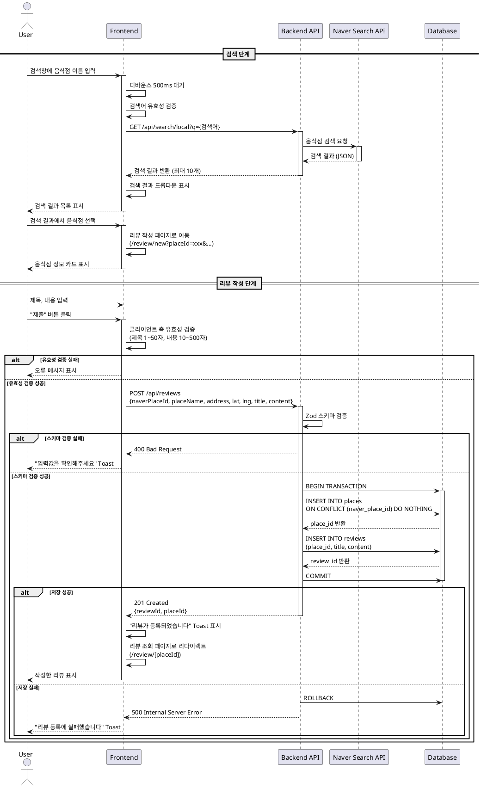

# 유스케이스 UC-002: 맛집 검색 및 리뷰 작성

## 문서 정보

- **유스케이스 ID**: UC-002
- **작성일**: 2025-10-22
- **버전**: 1.0
- **관련 User Flow**: 플로우 2 - 맛집 검색 및 리뷰 작성

---

## 1. 개요

### 1.1 목적
사용자가 네이버 검색 API를 통해 음식점을 검색하고, 검색 결과에서 선택한 음식점에 대한 리뷰를 작성할 수 있도록 한다.

### 1.2 Primary Actor
일반 사용자 (비로그인)

### 1.3 Precondition
- 사용자가 메인 페이지에 접속해 있음
- 검색창이 화면에 표시되어 있음

---

## 2. 트리거

사용자가 검색창에 음식점 이름을 입력하고 검색을 시작

---

## 3. Main Scenario

### 3.1 기본 흐름

#### Phase 1: 음식점 검색 (Naver Search API - Local)

1. **사용자**: 검색창에 음식점 이름 입력 (예: "홍대 파스타")
2. **FE**: 디바운스(500ms) 후 검색어 유효성 검증
3. **FE**: `/api/search/local?q={검색어}` API 호출
4. **BE**: 네이버 Search API로 프록시 요청 전송
   - 엔드포인트: `https://openapi.naver.com/v1/search/local.json`
   - 헤더: `X-Naver-Client-Id`, `X-Naver-Client-Secret` (서버 환경변수)
   - 파라미터: `query`, `display=10`, `start=1`, `sort=random`
   - 참고: 하루 호출 한도 25,000회
5. **BE**: 검색 결과를 클라이언트에 반환 (최대 10개)
   - 응답 필드: `title`, `address`, `roadAddress`, `mapx`, `mapy` (좌표)
6. **FE**: 검색 결과를 드롭다운으로 표시
7. **사용자**: 검색 결과 목록에서 원하는 음식점 선택

#### Phase 2: 리뷰 작성 페이지 렌더링 (Static Map API 활용)

8. **FE**: 리뷰 작성 페이지로 이동 (`/review/new?placeId=xxx&placeName=xxx&address=xxx&lat=xxx&lng=xxx`)
9. **FE**: 음식점 정보 카드 표시
   - 이름, 주소 표시
   - **Static Map 썸네일 렌더링**:
     - URL: `https://naveropenapi.apigw.ntruss.com/map-static/v2/raster?w=400&h=200&scale=2&markers=type:d|size:mid|pos:{lng}%20{lat}`
     - 인증: Referer 등록 또는 서버 프록시 호출 (헤더: `X-NCP-APIGW-API-KEY-ID/KEY`)
     - **중요**: NCP 콘솔에서 Web service URL 등록 필수 (Referer 검증)

#### Phase 3: 리뷰 작성 및 저장

10. **사용자**: 리뷰 제목(1~50자), 내용(10~500자) 입력
11. **사용자**: "제출" 버튼 클릭
12. **FE**: 클라이언트 측 유효성 검증 (react-hook-form + zod)
13. **FE**: `POST /api/reviews` 요청 전송
14. **BE**: 요청 데이터 Zod 스키마 검증
15. **BE**: `places` 테이블에서 `naver_place_id` 중복 확인
16. **BE**: 맛집 정보가 없으면 `places` 테이블에 INSERT
17. **BE**: `reviews` 테이블에 리뷰 INSERT
18. **BE**: 성공 응답 반환 (201 Created)
19. **FE**: 성공 메시지 표시 ("리뷰가 등록되었습니다")
20. **FE**: 해당 맛집의 리뷰 조회 페이지로 리다이렉트 (`/review/[placeId]`)

---

## 4. Edge Cases

### 4.1 검색 쿼리가 비어있음
- **발생 시점**: 사용자가 빈 검색창에서 검색 시도
- **처리**: 클라이언트 측에서 "음식점 이름을 입력해주세요" 인라인 오류 메시지 표시
- **에러 코드**: 없음 (클라이언트 측 처리)

### 4.2 검색 결과가 없음
- **발생 시점**: 네이버 API에서 빈 배열 반환
- **처리**: "검색 결과가 없습니다. 다른 키워드로 시도해주세요" 메시지 표시
- **에러 코드**: 200 OK (정상 응답, 빈 결과)

### 4.3 네이버 Search API 호출 실패
- **발생 시점**: API 할당량 초과, 네트워크 오류 등
- **처리**: "검색 중 오류가 발생했습니다. 잠시 후 다시 시도해주세요" Toast 알림
- **에러 코드**: 500 Internal Server Error

### 4.4 리뷰 작성 유효성 검증 실패
- **발생 시점**: 제목 빈값, 내용 10자 미만 등
- **처리**:
  - 제목 미입력: "제목을 입력해주세요"
  - 내용 10자 미만: "최소 10자 이상 입력해주세요"
  - 해당 필드에 빨간색 테두리 및 오류 메시지 표시
- **에러 코드**: 없음 (클라이언트 측 처리)

### 4.5 서버 저장 실패
- **발생 시점**: 데이터베이스 저장 중 오류 (연결 끊김, 제약조건 위반 등)
- **처리**:
  - "리뷰 등록에 실패했습니다. 다시 시도해주세요" Toast 알림
  - 사용자가 작성한 내용은 유지 (폼 초기화 안 함)
  - 트랜잭션 롤백으로 부분 저장 방지
- **에러 코드**: 500 Internal Server Error

### 4.6 네트워크 연결 끊김
- **발생 시점**: 리뷰 제출 중 네트워크 오류
- **처리**:
  - "네트워크 연결을 확인해주세요" 메시지
  - 재시도 버튼 제공
  - 작성 내용 유지
- **에러 코드**: Network Error (클라이언트)

---

## 5. Business Rules

### 5.1 검색 관련
- 검색 쿼리는 빈 문자열이 아니어야 함
- 디바운스 500ms 적용하여 과도한 API 호출 방지
- 검색 결과는 최대 10개만 표시

### 5.2 리뷰 작성 관련
- 제목: 1~50자 필수 입력
- 내용: 10~500자 필수 입력 (최소 10자 이상 작성 권장)
- 음식점 정보(placeId, placeName, address, lat, lng)는 URL 쿼리 파라미터로 전달
- 동일한 음식점에 여러 리뷰 작성 가능 (중복 제한 없음)

### 5.3 데이터 무결성
- 맛집 정보는 `naver_place_id` UNIQUE 제약으로 중복 방지
- 리뷰 작성 시 맛집 정보가 없으면 자동 생성 (`ON CONFLICT DO NOTHING`)
- 리뷰와 맛집은 트랜잭션으로 원자성 보장

### 5.4 보안
- **네이버 Search API 인증 관리**:
  - `X-Naver-Client-Id`/`X-Naver-Client-Secret`은 **서버 환경변수**에만 저장
  - 클라이언트 노출 절대 금지 (보안 위험)
  - Next.js API Route에서 프록시 호출 필수
  - 환경변수: `NAVER_SEARCH_CLIENT_ID`, `NAVER_SEARCH_CLIENT_SECRET`
- **Static Map API 인증 관리**:
  - Referer 검증 방식: NCP 콘솔에서 Web service URL 등록
  - 또는 서버 프록시 호출 시 헤더 주입 (`X-NCP-APIGW-API-KEY-ID/KEY`)
  - 환경변수: `NCP_CLIENT_ID`, `NCP_CLIENT_SECRET`
- 모든 입력 데이터는 Zod 스키마로 서버 측 재검증
- SQL Injection 방지 (Supabase 파라미터 바인딩)

---

## 6. Sequence Diagram



---

## 7. 후행 조건 (Post-conditions)

### 7.1 성공 시
- `places` 테이블에 음식점 정보 생성 또는 기존 레코드 재사용
- `reviews` 테이블에 새 리뷰 레코드 생성
- 메인 페이지의 맛집 카드 목록에 해당 음식점 표시 (리뷰 개수 증가)
- 리뷰 조회 페이지로 리다이렉트하여 작성한 리뷰 확인 가능

### 7.2 실패 시
- 데이터베이스 트랜잭션 롤백 (부분 저장 없음)
- 사용자가 작성한 내용은 폼에 유지 (재작성 방지)
- 오류 메시지 표시 및 재시도 옵션 제공

---

## 8. 비기능 요구사항

### 8.1 성능
- 검색 API 응답 시간: < 500ms
- 리뷰 작성 API 응답 시간: < 200ms
- 디바운스로 불필요한 API 호출 최소화

### 8.2 사용성
- 검색 결과는 즉시 표시 (로딩 인디케이터 제공)
- 리뷰 작성 중 오류 발생 시 작성 내용 유지
- 모든 오류 메시지는 사용자 친화적 표현 사용

---

## 9. 관련 유스케이스

- **선행 유스케이스**: UC-001 (메인 페이지 접속 및 탐색)
- **후행 유스케이스**: UC-003 (맛집 리뷰 조회)
- **연관 유스케이스**: UC-004 (리뷰 삭제)

---

## 10. 변경 이력

| 버전 | 날짜 | 작성자 | 변경 내용 |
|------|------|--------|-----------|
| 1.0 | 2025-10-22 | Claude | 초기 유스케이스 작성 |

---

## 부록

### A. API 명세 참고

#### A.1 네이버 장소 검색 프록시
```
GET /api/search/local?q={query}
Response: { items: [...] }
```

#### A.2 리뷰 생성
```
POST /api/reviews
Request Body:
{
  "naverPlaceId": "string",
  "placeName": "string",
  "address": "string",
  "latitude": number,
  "longitude": number,
  "title": "string",
  "content": "string"
}
Response: 201 Created
{
  "success": true,
  "data": {
    "reviewId": "uuid",
    "placeId": "uuid"
  }
}
```

### B. 참고 문서
- [PRD 문서](../../prd.md)
- [User Flow 문서](../../userflow.md) - 플로우 2
- [Database 문서](../../database.md)
- [네이버 지도 연동 가이드](../../naver-maps-integration.md) - Search API, Static Map API 연동 방법
- [네이버 Search API (Local) 공식 문서](https://developers.naver.com/docs/serviceapi/search/local/local.md)
- [네이버 Static Map API 공식 문서](https://api.ncloud-docs.com/docs/ai-naver-mapsstaticmap-raster)
- [NCP 콘솔 - 앱 등록](https://console.ncloud.com/naver-service/application)

### C. 환경변수 설정

프로젝트 루트의 `.env.local` 파일에 다음 환경변수 필수 설정:

```bash
# 네이버 Search API (Local) - 서버 전용
NAVER_SEARCH_CLIENT_ID=your_naver_search_client_id
NAVER_SEARCH_CLIENT_SECRET=your_naver_search_client_secret

# NCP Maps (Static Map 포함) - 서버/클라이언트
NCP_CLIENT_ID=your_ncp_client_id
NCP_CLIENT_SECRET=your_ncp_client_secret
NEXT_PUBLIC_NCP_CLIENT_ID=your_ncp_client_id  # 클라이언트용
```

**발급 방법**:
1. **Naver Search API**: [네이버 개발자 센터](https://developers.naver.com) → 애플리케이션 등록 → Search API (지역) 권한 추가
2. **NCP Maps**: NCP 콘솔 → AI·NAVER API → Maps 앱 생성 → Web service URL 등록
