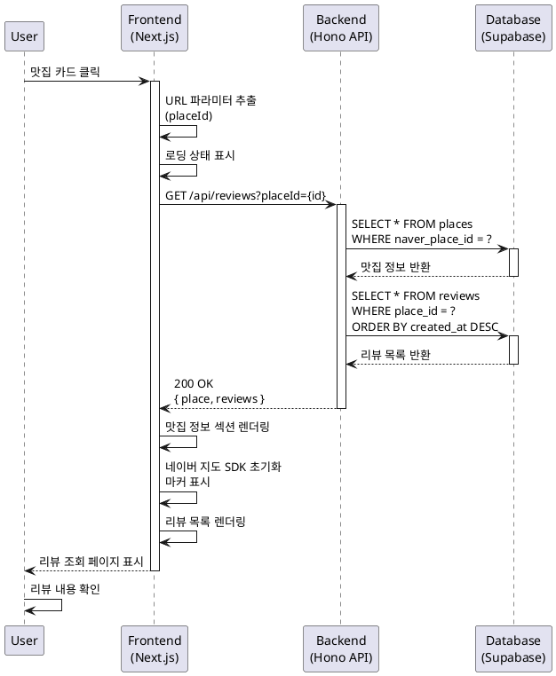

# 유스케이스: 맛집 리뷰 조회

## 유스케이스 ID: UC-003

### 제목
맛집 리뷰 상세 조회 및 지도 표시

---

## 1. 개요

### 1.1 목적
사용자가 특정 맛집의 상세 정보와 해당 맛집에 작성된 모든 리뷰를 조회하여, 방문 결정에 필요한 정보를 제공한다.

### 1.2 범위
- 맛집 상세 정보 표시 (이름, 주소, 위치)
- 해당 맛집의 전체 리뷰 목록 조회 (최신순)
- 네이버 지도 API를 통한 맛집 위치 마커 표시
- 리뷰 삭제 기능 접근점 제공

**제외 사항**:
- 리뷰 수정 기능 (MVP 범위 제외)
- 평점 표시 (Phase 5)
- 이미지 표시 (Phase 5)
- 작성자 정보 표시 (비로그인 시스템)

### 1.3 액터
- **주요 액터**: 일반 사용자
- **부 액터**: 네이버 지도 API

---

## 2. 선행 조건

- 사용자가 메인 페이지에 접속한 상태
- 조회하려는 맛집이 데이터베이스에 존재 (최소 1개 이상의 리뷰 보유)
- 브라우저가 정상적으로 작동하는 상태

---

## 3. 참여 컴포넌트

- **Frontend (Next.js)**: 리뷰 조회 페이지 렌더링, 사용자 인터랙션 처리
- **Backend (Hono API)**: 맛집 정보 및 리뷰 목록 조회 API 제공
- **Database (Supabase)**: `places`, `reviews` 테이블 조회
- **Naver Maps JavaScript API v3 (SDK)**: 맛집 위치 지도 표시
  - 공식 문서: https://navermaps.github.io/maps.js.ncp/
  - 사용 기능: 지도 렌더링, 마커 표시, InfoWindow (선택적)
  - 인증: `ncpKeyId` (NEXT_PUBLIC_NCP_CLIENT_ID)
  - 로딩: `next/script`의 `afterInteractive` 전략

---

## 4. 기본 플로우 (Basic Flow)

### 4.1 Trigger
- 사용자가 메인 페이지의 맛집 카드를 클릭
- 또는 지도의 마커 클릭 후 "자세히 보기" 선택

### 4.2 Main Scenario

1. **사용자**: 맛집 카드 또는 지도 마커 클릭
   - 입력: 맛집 고유 ID (`naver_place_id`)
   - 처리: 클릭 이벤트 발생
   - 출력: 리뷰 조회 페이지로 라우팅 (`/review/[placeId]`)

2. **Frontend**: 페이지 렌더링 시작
   - 입력: URL 파라미터 `placeId` 추출
   - 처리: 로딩 상태 표시 (스켈레톤 UI)
   - 출력: API 요청 (`GET /api/reviews?placeId={placeId}`)

3. **Backend**: 맛집 정보 조회
   - 입력: `placeId` (쿼리 파라미터)
   - 처리: `places` 테이블에서 `naver_place_id`로 검색
   - 출력: 맛집 정보 (이름, 주소, 위도, 경도) 또는 404

4. **Backend**: 리뷰 목록 조회
   - 입력: `place_id` (맛집 내부 UUID)
   - 처리: `reviews` 테이블에서 `place_id`로 필터링, `created_at DESC` 정렬
   - 출력: 리뷰 배열 (제목, 내용, 작성일)

5. **Frontend**: 응답 데이터 렌더링
   - 입력: API 응답 JSON
   - 처리:
     - 맛집 정보 섹션 표시 (헤더)
     - **네이버 지도 SDK로 지도 렌더링**:
       ```js
       // window.naver 객체 존재 확인
       const map = new naver.maps.Map('review-map', {
         center: new naver.maps.LatLng(place.latitude, place.longitude),
         zoom: 15, // 상세 페이지는 더 확대
         zoomControl: true,
         mapTypeControl: false
       });

       // 맛집 위치에 마커 표시
       const marker = new naver.maps.Marker({
         position: new naver.maps.LatLng(place.latitude, place.longitude),
         map: map,
         title: place.name
       });

       // (선택적) 인포윈도우 표시
       const infoWindow = new naver.maps.InfoWindow({
         content: `<div style="padding:10px;">${place.name}</div>`
       });
       infoWindow.open(map, marker);
       ```
     - 리뷰 목록 렌더링 (최신순)
   - 출력: 완성된 리뷰 조회 페이지
   - **참고**: NCP 콘솔에서 Web service URL 등록 필수 (도메인 검증)

6. **사용자**: 페이지 확인
   - 입력: 렌더링된 페이지
   - 처리: 리뷰 내용 확인, 지도에서 위치 확인
   - 출력: 필요 시 삭제 버튼 클릭 (UC-004로 분기) 또는 메인으로 복귀

### 4.3 시퀀스 다이어그램



---

## 5. 대안 플로우 (Alternative Flows)

### 5.1 대안 플로우 1: 직접 URL 접근

**시작 조건**: 사용자가 URL을 직접 입력하거나 북마크로 접근

**단계**:
1. 사용자가 `/review/[placeId]` URL 직접 입력
2. Frontend가 `placeId`로 API 요청
3. 기본 플로우 3단계부터 동일하게 진행

**결과**: 정상적으로 리뷰 조회 페이지 표시 (메인 페이지 거치지 않음)

---

## 6. 예외 플로우 (Exception Flows)

### 6.1 예외 상황 1: 맛집 정보 없음

**발생 조건**: 존재하지 않는 `placeId`로 접근

**처리 방법**:
1. Backend가 `places` 테이블 조회 시 NULL 반환
2. 404 상태 코드 응답
3. Frontend가 에러 페이지 렌더링

**에러 코드**: `404 Not Found`

**사용자 메시지**: "맛집 정보를 찾을 수 없습니다."

---

### 6.2 예외 상황 2: 빈 리뷰 목록

**발생 조건**: 맛집은 존재하지만 리뷰가 0개 (직접 URL 접근 시)

**처리 방법**:
1. Backend가 빈 배열 반환
2. Frontend가 맛집 정보는 표시하되, 리뷰 영역에 빈 상태 메시지 표시

**에러 코드**: `200 OK` (정상 응답)

**사용자 메시지**: "아직 리뷰가 없습니다. 첫 리뷰를 작성해보세요!"

---

### 6.3 예외 상황 3: 네트워크 오류

**발생 조건**: API 요청 중 네트워크 연결 끊김 또는 타임아웃

**처리 방법**:
1. Frontend에서 `fetch` 실패 감지
2. React Query의 재시도 로직 실행 (최대 3회)
3. 재시도 실패 시 오류 UI 표시

**에러 코드**: N/A (네트워크 에러)

**사용자 메시지**: "페이지를 불러올 수 없습니다. 네트워크 연결을 확인해주세요." (+ 재시도 버튼)

---

### 6.4 예외 상황 4: 지도 로딩 실패

**발생 조건**: 네이버 지도 API 스크립트 로딩 실패 또는 API 키 문제

**처리 방법**:
1. Frontend에서 지도 초기화 실패 감지
2. 지도 영역에 대체 메시지 표시
3. 나머지 정보(맛집 정보, 리뷰)는 정상 표시

**에러 코드**: N/A (클라이언트 에러)

**사용자 메시지**: "지도를 표시할 수 없습니다." (주소는 텍스트로 표시)

---

### 6.5 예외 상황 5: 이미지 로딩 실패 (향후)

**발생 조건**: 리뷰 이미지 URL이 유효하지 않거나 삭제됨 (Phase 5 기능)

**처리 방법**:
1. `` 태그의 `onError` 핸들러 실행
2. 대체 이미지(placeholder) 표시 또는 이미지 영역 숨김

**에러 코드**: N/A (리소스 로딩 에러)

**사용자 메시지**: (이미지 영역만 숨김, 별도 메시지 없음)

---

## 7. 후행 조건 (Post-conditions)

### 7.1 성공 시

- **데이터베이스 변경**: 없음 (조회 전용)
- **시스템 상태**: 리뷰 조회 페이지 렌더링 완료
- **외부 시스템**: 네이버 지도 API 호출 완료 (지도 표시)

### 7.2 실패 시

- **데이터 롤백**: 해당 없음
- **시스템 상태**: 에러 페이지 또는 빈 상태 UI 표시

---

## 8. 비즈니스 규칙 (Business Rules)

### 8.1 리뷰 정렬
- 리뷰 목록은 항상 **작성일 기준 내림차순**으로 정렬 (`created_at DESC`)
- 사용자가 정렬 순서를 변경할 수 없음 (MVP 범위)

### 8.2 데이터 표시
- 맛집 이름, 주소는 필수 표시
- 위도, 경도는 지도 렌더링에만 사용 (사용자에게 직접 표시 안 함)
- 리뷰 제목 최대 50자, 내용 최대 500자 (데이터베이스 제약)

### 8.3 삭제 버튼 표시
- 모든 리뷰에 삭제 버튼 표시 (비로그인 시스템으로 작성자 구분 불가)
- 삭제 시 확인 다이얼로그 필수 (UC-004 참고)

---

## 9. 비기능 요구사항

### 9.1 성능
- API 응답 시간: **< 500ms** (Supabase 쿼리 기준)
- 페이지 로딩 시간 (FCP): **< 2초** (Lighthouse 기준)
- 지도 렌더링 시간: **< 1초** (네이버 지도 SDK 초기화)

### 9.2 보안
- **네이버 지도 SDK 인증 관리**:
  - 클라이언트 ID는 브라우저 노출 허용 (`NEXT_PUBLIC_NCP_CLIENT_ID`)
  - 도메인 검증(Referer)으로 무단 사용 방지
  - NCP 콘솔에서 프로덕션/프리뷰/로컬 도메인 모두 등록 필수
- SQL Injection 방지: Supabase 파라미터 바인딩 사용
- XSS 방지: React 기본 HTML 이스케이프

### 9.3 가용성
- 네이버 지도 API 장애 시에도 리뷰 조회는 정상 작동
- 데이터베이스 연결 실패 시 재시도 로직 (React Query)

---

## 10. UI/UX 요구사항

### 10.1 화면 구성

```
┌─────────────────────────────────────┐
│  맛집 정보 헤더                      │
│  - 맛집명 (h1)                      │
│  - 주소 (텍스트)                     │
│  - 카테고리 (선택 사항, 향후)       │
├─────────────────────────────────────┤
│  지도 섹션                           │
│  - 네이버 지도 (맛집 위치 마커)      │
│  - 높이: 300px (모바일), 400px (데스크톱) │
├─────────────────────────────────────┤
│  리뷰 목록 섹션                      │
│  ┌───────────────────────────────┐  │
│  │ 리뷰 카드 1                   │  │
│  │ - 제목 (굵게)                 │  │
│  │ - 내용 (본문)                 │  │
│  │ - 작성일 (상대 시간 표시)     │  │
│  │ - 삭제 버튼 (우측 상단)       │  │
│  └───────────────────────────────┘  │
│  ┌───────────────────────────────┐  │
│  │ 리뷰 카드 2                   │  │
│  └───────────────────────────────┘  │
│  ...                                │
├─────────────────────────────────────┤
│  플로팅 액션 버튼 (FAB)              │
│  - "리뷰 작성하기" (우측 하단)       │
└─────────────────────────────────────┘
```

### 10.2 사용자 경험

- **로딩 상태**: 스켈레톤 UI로 데이터 로딩 중임을 명확히 표시
- **빈 상태**: 리뷰가 없을 경우 안내 메시지 + 작성 버튼 강조
- **작성일 표시**: `date-fns`로 상대 시간 표시 ("2시간 전", "3일 전")
- **반응형 디자인**: 모바일 우선, 카드 레이아웃 자동 조정
- **지도 인터랙션**: 드래그/확대/축소 가능, 마커 클릭 시 맛집 이름 툴팁

---

## 11. API 명세

### 11.1 요청

```
GET /api/reviews?placeId={naver_place_id}
```

**쿼리 파라미터**:
- `placeId` (string, required): 네이버 장소 고유 ID

### 11.2 응답 (성공)

```json
{
  "success": true,
  "data": {
    "place": {
      "id": "uuid-string",
      "naverPlaceId": "1234567890",
      "name": "맛있는 파스타",
      "address": "서울특별시 마포구 홍익로 123",
      "latitude": 37.551169,
      "longitude": 126.923979
    },
    "reviews": [
      {
        "id": "uuid-string",
        "title": "파스타가 정말 맛있어요",
        "content": "크림 파스타 추천합니다. 양도 푸짐하고...",
        "createdAt": "2025-10-22T12:00:00Z"
      },
      {
        "id": "uuid-string",
        "title": "분위기 좋은 이탈리안",
        "content": "데이트 코스로 추천합니다...",
        "createdAt": "2025-10-21T18:30:00Z"
      }
    ]
  }
}
```

### 11.3 응답 (맛집 없음)

```json
{
  "success": false,
  "error": {
    "code": "PLACE_NOT_FOUND",
    "message": "맛집 정보를 찾을 수 없습니다."
  }
}
```

**HTTP 상태 코드**: `404 Not Found`

---

## 12. 테스트 시나리오

### 12.1 성공 케이스

| 테스트 케이스 ID | 입력값 | 기대 결과 |
|----------------|--------|----------|
| TC-003-01      | 유효한 `placeId` (리뷰 3개) | 맛집 정보 + 3개 리뷰 표시 (최신순) |
| TC-003-02      | 유효한 `placeId` (리뷰 1개) | 맛집 정보 + 1개 리뷰 표시 |

### 12.2 실패 케이스

| 테스트 케이스 ID | 입력값 | 기대 결과 |
|----------------|--------|----------|
| TC-003-03      | 존재하지 않는 `placeId` | "맛집 정보를 찾을 수 없습니다" 오류 페이지 |
| TC-003-04      | 유효한 `placeId` (리뷰 0개) | 맛집 정보 + "아직 리뷰가 없습니다" 메시지 |
| TC-003-05      | 네트워크 연결 끊김 | "페이지를 불러올 수 없습니다" + 재시도 버튼 |
| TC-003-06      | 지도 API 로딩 실패 | 맛집 정보 + 리뷰는 정상, 지도만 오류 메시지 |

---

## 13. 관련 유스케이스

- **선행 유스케이스**: UC-001 (메인 페이지 접속 및 탐색)
- **후행 유스케이스**:
  - UC-002 (맛집 검색 및 리뷰 작성) - 리뷰 작성 버튼 클릭 시
  - UC-004 (리뷰 삭제) - 삭제 버튼 클릭 시
- **연관 유스케이스**: UC-005 (지도 인터랙션) - 지도 마커에서 접근 가능

---

## 14. 변경 이력

| 버전 | 날짜 | 작성자 | 변경 내용 |
|------|------|--------|-----------|
| 1.0  | 2025-10-22 | Claude | 초기 작성 (PRD 기반) |

---

## 부록

### A. 용어 정의

| 용어 | 정의 |
|------|------|
| `placeId` | 네이버 검색 API의 장소 고유 ID (`naver_place_id`) |
| 스켈레톤 UI | 로딩 중 컨텐츠 영역을 회색 박스로 표시하는 UX 패턴 |
| FAB (Floating Action Button) | 화면 우측 하단에 고정된 원형 버튼 |
| 상대 시간 | "2시간 전", "3일 전" 같은 형식의 시간 표시 |

### B. 참고 자료

- [PRD 문서](../../prd.md)
- [User Flow 문서](../../userflow.md) - 플로우 3
- [데이터베이스 설계](../../database.md)
- [네이버 지도 연동 가이드](../../naver-maps-integration.md) - SDK 설치/세팅, 마커/InfoWindow 사용법
- [Naver Maps JavaScript API v3 공식 문서](https://navermaps.github.io/maps.js.ncp/)
- [Naver Maps 튜토리얼 - InfoWindow](https://navermaps.github.io/maps.js.ncp/docs/tutorial-infowindow.example.html)
- [React Query 문서](https://tanstack.com/query/latest/docs/react/overview)

### C. 환경변수 설정

프로젝트 루트의 `.env.local` 파일에 다음 환경변수 필수 설정:

```
NEXT_PUBLIC_NCP_CLIENT_ID=your_ncp_client_id_here
```

**발급 방법**:
1. NCP 콘솔 → Services > AI·NAVER API > Application
2. Maps 앱 생성 → Client ID 발급
3. Web service URL 등록 (로컬/프리뷰/프로덕션 도메인 모두)
