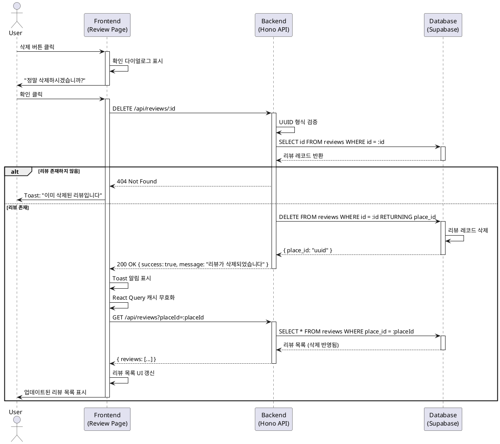

# 유스케이스: 리뷰 삭제

## UC-004

### 제목
리뷰 삭제

---

## 1. 개요

### 1.1 목적
사용자가 작성한 리뷰를 삭제하여 잘못되거나 불필요한 정보를 제거하고, 맛집의 평균 평점 및 리뷰 개수를 재계산한다.

### 1.2 범위
- 리뷰 조회 페이지에서 삭제 버튼 클릭을 통한 리뷰 삭제
- 삭제 확인 다이얼로그를 통한 실수 방지
- 삭제 후 UI 즉시 갱신
- 리뷰가 모두 삭제될 경우 맛집 카드 목록에서 제거

**제외 사항**:
- 리뷰 수정 기능 (PRD에서 제외됨)
- 삭제된 리뷰 복구 기능 (soft delete 없음)

### 1.3 액터
- **주요 액터**: 일반 사용자
- **부 액터**: Backend API, Database

---

## 2. 선행 조건

- 사용자가 리뷰 조회 페이지(`/review/[placeId]`)에 접근한 상태
- 해당 맛집에 최소 1개 이상의 리뷰가 존재
- 삭제하려는 리뷰가 데이터베이스에 존재

---

## 3. 참여 컴포넌트

- **Frontend (리뷰 조회 페이지)**: 삭제 버튼 UI 제공, 확인 다이얼로그 표시, 리뷰 목록 갱신
- **Backend API (Hono)**: 삭제 요청 검증 및 처리
- **Database (Supabase)**: 리뷰 레코드 삭제, 트랜잭션 관리
- **Toast 알림**: 삭제 성공/실패 메시지 표시

---

## 4. 기본 플로우 (Basic Flow)

### 4.1 단계별 흐름

1. **사용자**: 리뷰 조회 페이지에서 특정 리뷰 카드의 "삭제" 버튼 클릭
   - 입력: 삭제 버튼 클릭 이벤트
   - 처리: 프론트엔드에서 삭제 확인 다이얼로그 표시
   - 출력: "정말 이 리뷰를 삭제하시겠습니까?" 다이얼로그

2. **사용자**: 확인 다이얼로그에서 "삭제" 버튼 클릭
   - 입력: 확인 버튼 클릭
   - 처리: 리뷰 ID 추출, 삭제 API 호출
   - 출력: `DELETE /api/reviews/:id` 요청 전송

3. **Backend**: 삭제 요청 수신 및 검증
   - 입력: `reviewId` (URL 파라미터)
   - 처리:
     - UUID 형식 검증
     - 데이터베이스에서 리뷰 존재 여부 확인
   - 출력: 검증 성공 시 다음 단계 진행, 실패 시 404 오류

4. **Backend**: 리뷰 삭제 실행
   - 입력: 검증된 `reviewId`
   - 처리:
     - `DELETE FROM reviews WHERE id = $1 RETURNING place_id` 쿼리 실행
     - CASCADE로 연결된 데이터 자동 삭제 (현재는 없음)
     - 삭제된 리뷰의 `place_id` 반환
   - 출력: 삭제 성공 응답 `{ success: true, message: "리뷰가 삭제되었습니다" }`

5. **Frontend**: 삭제 성공 처리
   - 입력: 서버 응답 수신
   - 처리:
     - Toast 알림 표시: "리뷰가 삭제되었습니다"
     - React Query 캐시 무효화 (`invalidateQueries`)
     - 리뷰 목록 재조회
   - 출력: 삭제된 리뷰가 제거된 최신 목록 표시

6. **Frontend**: 리뷰 개수 확인 및 UI 업데이트
   - 입력: 재조회된 리뷰 목록
   - 처리: 리뷰 개수 확인
   - 출력:
     - 리뷰가 남아있는 경우: 업데이트된 목록 표시
     - 마지막 리뷰였던 경우: "아직 리뷰가 없습니다" 빈 상태 UI 표시

### 4.2 시퀀스 다이어그램



---

## 5. 대안 플로우 (Alternative Flows)

### 5.1 대안 플로우 1: 사용자가 삭제 취소

**시작 조건**: 삭제 확인 다이얼로그가 표시된 상태

**단계**:
1. 사용자가 "취소" 버튼 클릭
2. 프론트엔드에서 다이얼로그 닫기
3. 리뷰 조회 페이지 상태 유지 (아무런 변경 없음)

**결과**: 리뷰 삭제가 진행되지 않고 페이지 유지

---

## 6. 예외 플로우 (Exception Flows)

### 6.1 예외 상황 1: 리뷰가 이미 삭제됨

**발생 조건**: 다른 탭/세션에서 동일 리뷰가 이미 삭제된 경우

**처리 방법**:
1. Backend에서 리뷰 존재 여부 확인 실패
2. `404 Not Found` 응답 반환
3. Frontend에서 Toast 알림 표시: "이미 삭제된 리뷰입니다"
4. React Query 캐시 무효화 및 리뷰 목록 재조회

**에러 코드**: `404`

**사용자 메시지**: "이미 삭제된 리뷰입니다"

### 6.2 예외 상황 2: 네트워크 오류

**발생 조건**: 삭제 요청 중 네트워크 연결 끊김 또는 타임아웃

**처리 방법**:
1. Fetch API에서 네트워크 에러 감지
2. React Query에서 자동 재시도 (최대 3회)
3. 모든 재시도 실패 시 Toast 알림: "삭제에 실패했습니다. 네트워크 연결을 확인해주세요"
4. 재시도 버튼 제공

**에러 코드**: `NETWORK_ERROR`

**사용자 메시지**: "삭제에 실패했습니다. 네트워크 연결을 확인해주세요"

### 6.3 예외 상황 3: 서버 오류

**발생 조건**: 데이터베이스 삭제 중 예상치 못한 오류 발생

**처리 방법**:
1. Backend에서 에러 캐치 및 로깅
2. 트랜잭션 롤백 (데이터 일관성 유지)
3. `500 Internal Server Error` 응답 반환
4. Frontend에서 Toast 알림: "삭제 중 오류가 발생했습니다. 잠시 후 다시 시도해주세요"

**에러 코드**: `500`

**사용자 메시지**: "삭제 중 오류가 발생했습니다. 잠시 후 다시 시도해주세요"

### 6.4 예외 상황 4: 권한 없음 (향후 고려)

**발생 조건**: 비로그인 시스템에서는 발생하지 않지만, Phase 4 (인증 도입) 이후 고려 필요

**처리 방법** (향후 구현):
1. Backend에서 사용자 ID와 리뷰 작성자 비교
2. 불일치 시 `403 Forbidden` 응답
3. Frontend에서 Toast 알림: "삭제 권한이 없습니다"

**에러 코드**: `403`

**사용자 메시지**: "삭제 권한이 없습니다"

---

## 7. 후행 조건 (Post-conditions)

### 7.1 성공 시

- **데이터베이스 변경**:
  - `reviews` 테이블에서 해당 리뷰 레코드 영구 삭제 (hard delete)
  - 외래 키 CASCADE로 연결된 데이터 자동 삭제 (현재는 없음)

- **시스템 상태**:
  - 리뷰 조회 페이지의 리뷰 목록에서 삭제된 리뷰 제거
  - 맛집의 리뷰 개수 감소 (동적 계산)
  - 마지막 리뷰였을 경우 메인 페이지의 맛집 카드 목록에서 해당 맛집 제거 (리뷰 없으면 노출 안 됨)

- **캐시 상태**:
  - React Query 캐시 무효화
  - 메인 페이지 캐시 무효화 (리뷰 개수 변경)

### 7.2 실패 시

- **데이터 롤백**: 데이터베이스 변경사항 없음 (트랜잭션 롤백)
- **시스템 상태**: UI 상태 변경 없음, 오류 메시지만 표시
- **캐시 상태**: 캐시 유지 (갱신 안 됨)

---

## 8. 비즈니스 규칙 (Business Rules)

### 8.1 삭제 권한
- **현재 (비로그인 시스템)**: 모든 사용자가 모든 리뷰 삭제 가능
- **향후 (Phase 4)**: 본인이 작성한 리뷰만 삭제 가능

### 8.2 삭제 방식
- **Hard Delete**: 리뷰 레코드 영구 삭제 (복구 불가)
- Soft Delete는 사용하지 않음 (MVP 범위 외)

### 8.3 확인 절차
- 실수 방지를 위해 삭제 확인 다이얼로그 필수
- "되돌리기" 기능은 제공하지 않음

### 8.4 리뷰 개수 갱신
- 리뷰 삭제 시 맛집의 리뷰 개수는 동적 계산 (`COUNT(*)`)
- 평균 평점은 현재 구현 안 됨 (Phase 5)

### 8.5 맡집 카드 노출 규칙
- 리뷰가 1개 이상 있는 맛집만 메인 페이지 카드 목록에 노출
- 마지막 리뷰 삭제 시 자동으로 맛집 카드 목록에서 제거됨

---

## 9. 비기능 요구사항

### 9.1 성능
- 삭제 API 응답 시간: < 200ms
- React Query 캐시 무효화 및 재조회: < 300ms
- 전체 삭제 플로우 완료: < 1초

### 9.2 보안
- **현재**: UUID 형식 검증으로 기본적인 악의적 입력 방지
- **향후**: 사용자 인증 및 권한 검증 추가 (Phase 4)
- SQL Injection 방지: Supabase 파라미터 바인딩 사용

### 9.3 가용성
- 네트워크 오류 시 자동 재시도 (최대 3회)
- 서버 오류 시 사용자 친화적 에러 메시지 제공

---

## 10. UI/UX 요구사항

### 10.1 삭제 버튼
- 각 리뷰 카드 우측 상단 또는 하단에 "삭제" 버튼 배치
- 버튼 색상: 경고 색상 (빨간색 계열) 또는 중립 색상
- 아이콘: 휴지통 아이콘 (lucide-react `Trash2`)

### 10.2 확인 다이얼로그
- shadcn-ui `AlertDialog` 컴포넌트 사용
- 제목: "리뷰 삭제"
- 내용: "정말 이 리뷰를 삭제하시겠습니까?"
- 버튼:
  - "취소" (기본 스타일)
  - "삭제" (위험 스타일, 빨간색)

### 10.3 Toast 알림
- shadcn-ui `Toast` 컴포넌트 사용
- 성공: "리뷰가 삭제되었습니다" (초록색)
- 실패: 오류 메시지 (빨간색)
- 자동 닫힘: 3초 후

### 10.4 로딩 상태
- 삭제 버튼 클릭 후 API 응답 대기 중 버튼 비활성화
- 로딩 스피너 표시 (선택 사항)

### 10.5 빈 상태
- 마지막 리뷰 삭제 시 즉시 "아직 리뷰가 없습니다. 첫 리뷰를 작성해보세요!" 메시지 표시
- "리뷰 작성하기" 버튼 표시

---

## 11. API 명세

### 11.1 리뷰 삭제 API

**Endpoint**: `DELETE /api/reviews/:id`

**Path Parameters**:
- `id` (UUID, required): 삭제할 리뷰 ID

**Request Headers**:
- `Content-Type`: `application/json`

**Request Body**: 없음

**Response 200 (성공)**:
```json
{
  "success": true,
  "message": "리뷰가 삭제되었습니다"
}
```

**Response 404 (리뷰 없음)**:
```json
{
  "success": false,
  "error": "REVIEW_NOT_FOUND",
  "message": "리뷰를 찾을 수 없습니다"
}
```

**Response 500 (서버 오류)**:
```json
{
  "success": false,
  "error": "INTERNAL_SERVER_ERROR",
  "message": "삭제 중 오류가 발생했습니다"
}
```

---

## 12. 데이터베이스 쿼리

### 12.1 리뷰 삭제 쿼리

```sql
DELETE FROM reviews
WHERE id = $1
RETURNING place_id;
```

**참고**:
- `RETURNING` 절로 삭제된 리뷰의 `place_id` 반환 (캐시 무효화에 활용)
- CASCADE 설정으로 연관 데이터 자동 삭제 (현재는 없음)

### 12.2 맛집 리뷰 개수 확인 (삭제 후)

```sql
SELECT COUNT(*) AS review_count
FROM reviews
WHERE place_id = $1;
```

**참고**:
- 리뷰 개수가 0이면 메인 페이지 캐시 무효화 필요

---

## 13. 테스트 시나리오

### 13.1 성공 케이스

| 테스트 케이스 ID | 전제 조건 | 입력값 | 기대 결과 |
|----------------|----------|--------|----------|
| TC-004-01 | 리뷰가 2개 이상 있는 맛집 | 첫 번째 리뷰 삭제 | 리뷰 삭제 성공, 목록에서 제거, Toast 표시 |
| TC-004-02 | 리뷰가 1개만 있는 맛집 | 해당 리뷰 삭제 | 리뷰 삭제 성공, 빈 상태 UI 표시 |
| TC-004-03 | 삭제 확인 다이얼로그 표시 | "취소" 버튼 클릭 | 다이얼로그 닫힘, 리뷰 유지 |

### 13.2 실패 케이스

| 테스트 케이스 ID | 전제 조건 | 입력값 | 기대 결과 |
|----------------|----------|--------|----------|
| TC-004-04 | 리뷰가 이미 삭제됨 | 삭제된 리뷰 ID | 404 오류, "이미 삭제된 리뷰입니다" Toast |
| TC-004-05 | 네트워크 연결 끊김 | 삭제 버튼 클릭 | 네트워크 오류 Toast, 재시도 옵션 |
| TC-004-06 | 잘못된 UUID 형식 | `DELETE /api/reviews/invalid-id` | 400 오류, "잘못된 요청입니다" Toast |
| TC-004-07 | 서버 데이터베이스 오류 | 정상 리뷰 ID | 500 오류, "삭제 중 오류가 발생했습니다" Toast |

---

## 14. 관련 유스케이스

- **선행 유스케이스**: UC-003 (리뷰 조회)
- **후행 유스케이스**: 없음 (종료 플로우)
- **연관 유스케이스**:
  - UC-001 (메인 페이지 접속): 마지막 리뷰 삭제 시 맛집 카드 목록 갱신
  - UC-002 (리뷰 작성): 삭제 후 재작성 가능

---

## 15. 변경 이력

| 버전 | 날짜 | 작성자 | 변경 내용 |
|------|------|--------|-----------|
| 1.0  | 2025-10-22 | Claude | 초기 작성 |

---

## 부록

### A. 용어 정의

- **Hard Delete**: 데이터베이스에서 레코드를 영구적으로 삭제하는 방식 (복구 불가)
- **Soft Delete**: 레코드를 삭제하지 않고 `deleted_at` 컬럼을 업데이트하여 논리적으로 삭제 처리 (복구 가능)
- **CASCADE**: 외래 키 제약조건에서 부모 레코드 삭제 시 자식 레코드도 자동 삭제
- **Toast**: 사용자에게 일시적으로 표시되는 알림 메시지

### B. 참고 자료

- [PRD 문서](../../prd.md)
- [User Flow 문서](../../userflow.md) - 플로우 4
- [Database 문서](../../database.md) - reviews 테이블
- [네이버 지도 연동 가이드](../../naver-maps-integration.md)
- [shadcn-ui AlertDialog](https://ui.shadcn.com/docs/components/alert-dialog)
- [shadcn-ui Toast](https://ui.shadcn.com/docs/components/toast)

**참고**: UC-004는 리뷰 삭제 기능으로 네이버 지도/API 연동이 직접적으로 필요하지 않습니다. Backend API (`DELETE /api/reviews/:id`)만 사용합니다.
