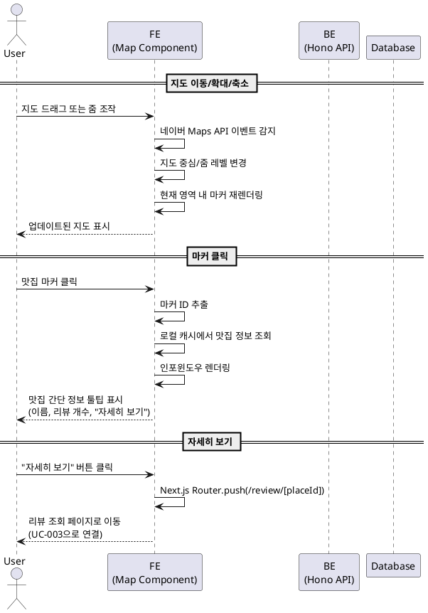

# 유스케이스 UC-005: 지도 인터랙션

## 1. 개요

### 1.1 목적
사용자가 메인 페이지의 네이버 지도를 통해 맛집 위치를 시각적으로 탐색하고, 마커 클릭을 통해 맛집 상세 정보로 빠르게 이동할 수 있도록 한다.

### 1.2 범위
- 지도 이동(드래그) 및 확대/축소
- 맛집 마커 표시 및 클릭 인터랙션
- 인포윈도우를 통한 간단 정보 표시
- 리뷰 조회 페이지로의 네비게이션

**제외 사항**:
- 지도 클러스터링 (MVP 단계에서는 제외, 맛집 100개 이상 시 고려)
- 현재 위치 기능
- 길찾기 기능

### 1.3 액터
- **주요 액터**: 일반 사용자
- **부 액터**: 네이버 Maps API, 백엔드 API, 데이터베이스

---

## 2. 선행 조건

- 사용자가 메인 페이지(`/`)에 접속한 상태
- 네이버 Maps JavaScript API v3가 정상적으로 로드됨
- 브라우저가 JavaScript 실행을 지원함
- 데이터베이스에 리뷰가 등록된 맛집이 1개 이상 존재함 (마커 표시를 위해)

---

## 3. 참여 컴포넌트

- **FE - 지도 컴포넌트**: 네이버 Maps JavaScript API v3를 통한 지도 렌더링 및 이벤트 처리
  - 공식 문서: https://navermaps.github.io/maps.js.ncp/
  - 사용 기능: Map, Marker, InfoWindow, Event Listener
  - 로딩: `next/script`의 `afterInteractive` 전략
  - 스크립트 URL: `https://oapi.map.naver.com/openapi/v3/maps.js?ncpKeyId={NEXT_PUBLIC_NCP_CLIENT_ID}`
- **FE - 마커 관리**: 맛집 위치 마커 생성 및 인포윈도우 표시
  - Marker API: `naver.maps.Marker`
  - InfoWindow API: `naver.maps.InfoWindow`
  - 이벤트: `click`, `mouseover`, `mouseout`
- **BE - API**: 맛집 목록 조회 API (`GET /api/places/with-reviews`)
- **Database - places 테이블**: 맛집 위치 정보(위도, 경도) 저장
- **Database - reviews 테이블**: 리뷰 개수 집계

---

## 4. 기본 플로우 (Basic Flow)

### 4.1 단계별 흐름

#### 4.1.1 지도 이동/확대/축소

1. **사용자**: 지도를 드래그하거나 확대/축소 버튼 클릭
   - 입력: 마우스 드래그 또는 줌 컨트롤 클릭
   - 처리: 네이버 Maps API 이벤트 리스너가 감지
   - 출력: 지도 중심 좌표 및 줌 레벨 변경

2. **FE**: 지도 영역 변경에 따라 마커 재렌더링
   - 처리: 현재 표시 영역 내 맛집 마커만 표시 (성능 최적화)
   - 출력: 부드러운 애니메이션과 함께 지도 업데이트

#### 4.1.2 마커 클릭

1. **사용자**: 지도 위의 맛집 마커 클릭
   - 입력: 마커 클릭 이벤트
   - 처리: 해당 마커의 맛집 ID 추출

2. **FE**: 맛집 간단 정보 조회
   - 입력: 맛집 ID
   - 처리: 로컬 캐시에서 맛집 정보 조회 (이미 메인 페이지 로드 시 받아온 데이터 활용)
   - 출력: 맛집 이름, 평균 평점 (Phase 5 이후), 리뷰 개수

3. **FE**: 인포윈도우 표시 (네이버 Maps InfoWindow API)
   - 입력: 맛집 정보
   - 처리:
     ```js
     // 기존 인포윈도우가 있다면 닫기
     if (currentInfoWindow) {
       currentInfoWindow.close();
     }

     // 인포윈도우 생성
     const infoWindow = new naver.maps.InfoWindow({
       content: `
         <div style="padding:15px; min-width:200px;">
           <h3 style="margin:0 0 10px 0; font-size:16px;">${place.name}</h3>
           <p style="margin:0 0 10px 0; color:#666;">리뷰 ${place.reviewCount}개</p>
           <a href="/review/${place.id}"
              style="display:inline-block; padding:8px 16px; background:#4285f4; color:white; text-decoration:none; border-radius:4px;">
             자세히 보기
           </a>
         </div>
       `,
       borderWidth: 0,
       disableAnchor: true,
       backgroundColor: 'transparent'
     });

     // 마커 위에 표시
     infoWindow.open(map, marker);

     // 현재 인포윈도우 참조 저장
     setCurrentInfoWindow(infoWindow);
     ```
   - 출력: 마커 위에 툴팁 형태로 정보 표시
     - 맛집 이름
     - 리뷰 개수 (예: "리뷰 5개")
     - "자세히 보기" 링크 버튼

4. **사용자**: 인포윈도우의 "자세히 보기" 버튼 클릭
   - 입력: 버튼 클릭 이벤트
   - 처리: Next.js 라우터를 통한 페이지 전환
   - 출력: `/review/[placeId]` 페이지로 이동 (UC-003 리뷰 조회로 연결)

### 4.2 시퀀스 다이어그램



---

## 5. 대안 플로우 (Alternative Flows)

### 5.1 대안 플로우 1: 빈 영역 클릭

**시작 조건**: 사용자가 마커가 없는 지도 영역 클릭

**단계**:
1. 사용자가 빈 영역 클릭
2. FE가 클릭 이벤트 무시 (아무 동작 없음)
3. 기존 인포윈도우가 열려있다면 자동으로 닫힘

**결과**: 지도 상태 유지, 사용자는 계속 탐색 가능

### 5.2 대안 플로우 2: 다른 마커 연속 클릭

**시작 조건**: 사용자가 인포윈도우가 이미 열린 상태에서 다른 마커 클릭

**단계**:
1. 사용자가 새로운 마커 클릭
2. FE가 기존 인포윈도우 닫기
3. 새로운 마커의 인포윈도우 표시

**결과**: 한 번에 하나의 인포윈도우만 표시됨 (UX 개선)

---

## 6. 예외 플로우 (Exception Flows)

### 6.1 예외 상황 1: 지도 API 로딩 실패

**발생 조건**: 네이버 Maps API 스크립트 로드 실패 또는 API 키 오류

**처리 방법**:
1. FE가 스크립트 로드 에러 감지 (`onerror` 이벤트)
2. 지도 영역에 대체 UI 표시: "지도를 불러올 수 없습니다"
3. 맛집 카드 리스트는 정상 표시 (지도 없이도 서비스 이용 가능)
4. 에러 로그를 콘솔에 출력 (개발 환경) 또는 모니터링 시스템에 전송 (프로덕션)

**에러 코드**: N/A (클라이언트 측 에러)

**사용자 메시지**: "지도를 불러올 수 없습니다. 페이지를 새로고침해주세요."

### 6.2 예외 상황 2: 마커 정보 로딩 실패

**발생 조건**: 마커 클릭 시 로컬 캐시에서 맛집 정보를 찾을 수 없음 (데이터 동기화 문제)

**처리 방법**:
1. FE가 캐시 miss 감지
2. 인포윈도우에 간단한 에러 메시지 표시: "정보를 불러올 수 없습니다"
3. "자세히 보기" 버튼은 비활성화
4. 개발자 콘솔에 경고 로그 출력

**에러 코드**: N/A (클라이언트 측 에러)

**사용자 메시지**: "맛집 정보를 불러올 수 없습니다."

### 6.3 예외 상황 3: 너무 많은 마커 (향후 확장 시)

**발생 조건**: 확대된 영역에 표시해야 할 맛집 마커가 100개 이상

**처리 방법**:
1. FE가 마커 개수 확인
2. 현재는 모든 마커 표시 (MVP에서는 데이터가 적음)
3. 향후: 마커 클러스터링 라이브러리 도입 또는 상위 N개만 표시
4. 안내 메시지: "더 많은 맛집을 보려면 지도를 확대해주세요"

**에러 코드**: N/A

**사용자 메시지**: "확대하면 더 많은 맛집을 볼 수 있습니다"

---

## 7. 후행 조건 (Post-conditions)

### 7.1 성공 시

- **데이터베이스 변경**: 없음 (조회만 수행)
- **시스템 상태**: 지도 중심 좌표 및 줌 레벨이 사용자의 마지막 조작 상태로 유지됨
- **외부 시스템**: 네이버 Maps API 호출 완료

### 7.2 실패 시

- **데이터 롤백**: 해당 없음 (읽기 전용 작업)
- **시스템 상태**: 지도는 이전 상태 유지, 대체 UI 표시
- **사용자 경험**: 맛집 카드 리스트를 통한 대체 경로 제공

---

## 8. 비기능 요구사항

### 8.1 성능
- 지도 초기 렌더링 시간: 1초 이내
- 마커 클릭 후 인포윈도우 표시: 100ms 이내
- 지도 드래그 시 끊김 없는 부드러운 애니메이션 (60fps)

### 8.2 보안
- **네이버 Maps SDK 인증 관리**:
  - 클라이언트 ID는 브라우저 노출 허용 (`NEXT_PUBLIC_NCP_CLIENT_ID`)
  - 도메인 검증(Referer)으로 무단 사용 방지
  - NCP 콘솔에서 프로덕션/프리뷰/로컬 도메인 모두 등록 필수
  - 예시: `http://localhost:3000`, `https://yourapp.vercel.app`, `https://yourapp-preview.vercel.app`
- HTTPS 전송으로 통신 보호

### 8.3 가용성
- 네이버 Maps API 장애 시에도 맛집 카드 리스트는 정상 작동
- 오프라인 모드 미지원 (지도는 온라인 전용)

---

## 9. UI/UX 요구사항

### 9.1 화면 구성
- 지도 영역: 메인 페이지 중앙, 최소 높이 400px
- 마커: 맛집 위치에 빨간색 핀 아이콘
- 인포윈도우: 마커 위 툴팁 형태, 흰색 배경
- 줌 컨트롤: 지도 우측 상단 (네이버 Maps 기본 UI)

### 9.2 사용자 경험
- 마커에 마우스 오버 시 커서가 포인터로 변경 (클릭 가능 표시)
- 인포윈도우는 마커 클릭 시 즉시 표시, 다른 곳 클릭 시 자동으로 닫힘
- 모바일에서는 터치 제스처 지원 (핀치 줌, 드래그)

---

## 10. Edge Cases

### 10.1 맛집 데이터 없음
- **상황**: 데이터베이스에 리뷰가 있는 맛집이 0개
- **처리**: 지도는 기본 중심 좌표(서울 시청)로 표시, 마커 없음
- **사용자 안내**: "아직 등록된 맛집이 없습니다. 첫 리뷰를 작성해보세요!"

### 10.2 지도 조작 오류
- **상황**: 네이버 Maps API에서 예상치 못한 오류 발생
- **처리**: 에러 캐치 및 로깅, 지도 상태 유지
- **사용자 경험**: UX 방해 최소화, 오류 무시

### 10.3 네트워크 지연
- **상황**: 지도 타일 로딩이 느림
- **처리**: 로딩 스피너 표시, 타일이 순차적으로 로드됨
- **사용자 안내**: 로딩 중 표시 (네이버 Maps 기본 동작)

---

## 11. Business Rules

1. **마커 표시 조건**: 리뷰가 1개 이상 등록된 맛집만 마커로 표시
2. **인포윈도우 내용**: 맛집 이름, 리뷰 개수, "자세히 보기" 버튼 필수
3. **지도 초기 중심**: 서울 시청 (위도 37.5665, 경도 126.9780), 줌 레벨 13
4. **리뷰 조회 연동**: "자세히 보기" 클릭 시 반드시 `/review/[placeId]` 페이지로 이동
5. **인포윈도우 중복 방지**: 한 번에 하나의 인포윈도우만 표시
6. **마커 클러스터링**: MVP 단계에서는 미적용, 맛집 100개 이상 시 Phase 2에서 고려

---

## 12. 관련 유스케이스

- **선행 유스케이스**: UC-001 메인 페이지 접속 및 탐색
- **후행 유스케이스**: UC-003 리뷰 조회 (마커 클릭 → "자세히 보기")
- **연관 유스케이스**: UC-002 리뷰 작성 (리뷰 조회 페이지에서 리뷰 작성 가능)

---

## 13. 변경 이력

| 버전 | 날짜 | 작성자 | 변경 내용 |
|------|------|--------|-----------|
| 1.0  | 2025-10-22 | Claude | 초기 작성 (플로우 5: 지도 인터랙션) |

---

## 부록

### A. 용어 정의

| 용어 | 정의 |
|------|------|
| 마커 (Marker) | 지도 위에 특정 위치를 표시하는 시각적 아이콘 |
| 인포윈도우 (InfoWindow) | 마커 클릭 시 표시되는 정보 툴팁 |
| 줌 레벨 (Zoom Level) | 지도의 확대/축소 정도 (1~21, 숫자가 클수록 확대) |
| 지도 클러스터링 | 여러 마커를 그룹화하여 표시하는 기법 (성능 최적화) |

### B. 참고 자료

- [네이버 지도 연동 가이드](../../naver-maps-integration.md) - SDK 설치/세팅, 이벤트 처리, 마커/InfoWindow 사용법
- [Naver Maps JavaScript API v3 공식 문서](https://navermaps.github.io/maps.js.ncp/)
- [Naver Maps 튜토리얼 - Marker](https://navermaps.github.io/maps.js.ncp/docs/tutorial-2-Marker.html)
- [Naver Maps 튜토리얼 - InfoWindow](https://navermaps.github.io/maps.js.ncp/docs/tutorial-infowindow.example.html)
- [Naver Maps 이벤트 리스너](https://navermaps.github.io/maps.js.ncp/docs/naver.maps.Map.html#event:click)
- [PRD 문서](../../prd.md) - 섹션 4.2.1: 메인 페이지 지도 뷰 명세
- [User Flow 문서](../../userflow.md) - 플로우 5: 지도 인터랙션

### C. 환경변수 설정

프로젝트 루트의 `.env.local` 파일에 다음 환경변수 필수 설정:

```
NEXT_PUBLIC_NCP_CLIENT_ID=your_ncp_client_id_here
```

**발급 방법**:
1. NCP 콘솔 → Services > AI·NAVER API > Application
2. Maps 앱 생성 → Client ID 발급
3. **Web service URL 등록** (매우 중요):
   - 로컬 개발: `http://localhost:3000`
   - Vercel 프리뷰: `https://*.vercel.app` (와일드카드 지원)
   - 프로덕션: `https://yourdomain.com`

### D. 지도 이벤트 리스너 예시

```js
// 마커 클릭 이벤트
naver.maps.Event.addListener(marker, 'click', function() {
  // 인포윈도우 표시 로직
});

// 지도 클릭 이벤트 (인포윈도우 닫기)
naver.maps.Event.addListener(map, 'click', function() {
  if (currentInfoWindow) {
    currentInfoWindow.close();
  }
});

// 지도 중심 변경 이벤트
naver.maps.Event.addListener(map, 'center_changed', function(center) {
  console.log('새로운 중심 좌표:', center);
});
```
