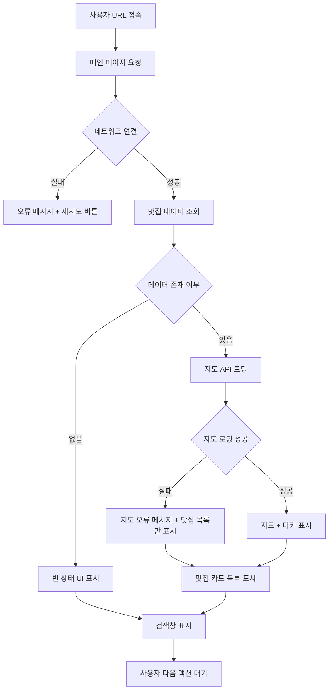
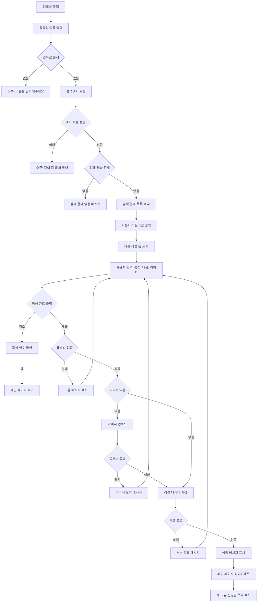
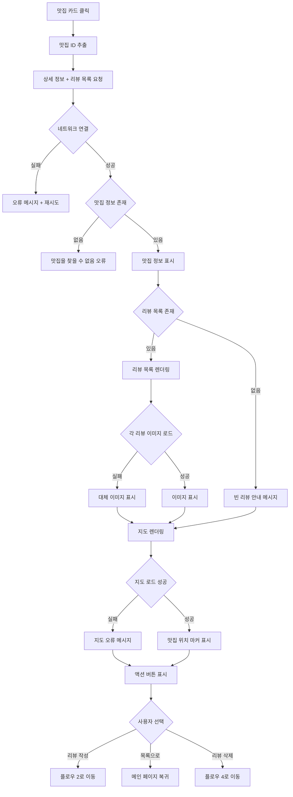
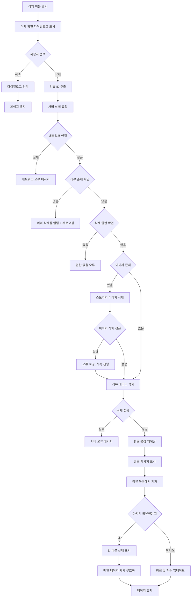
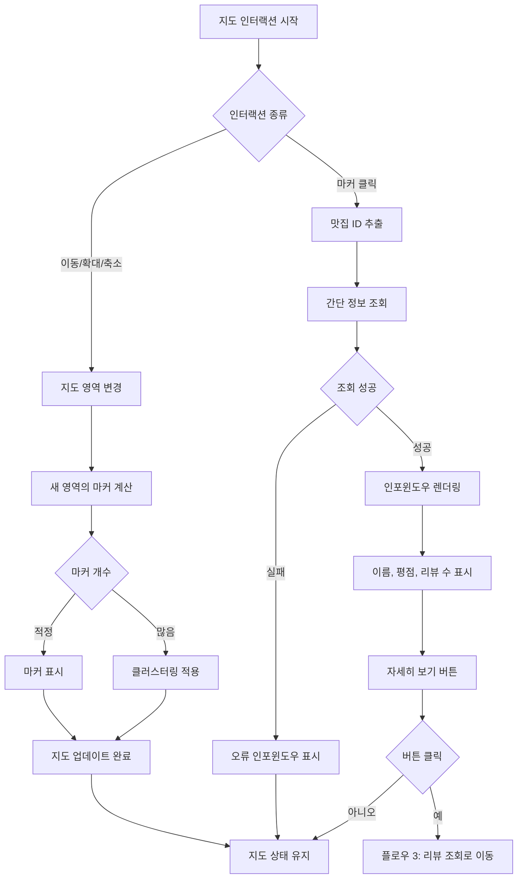
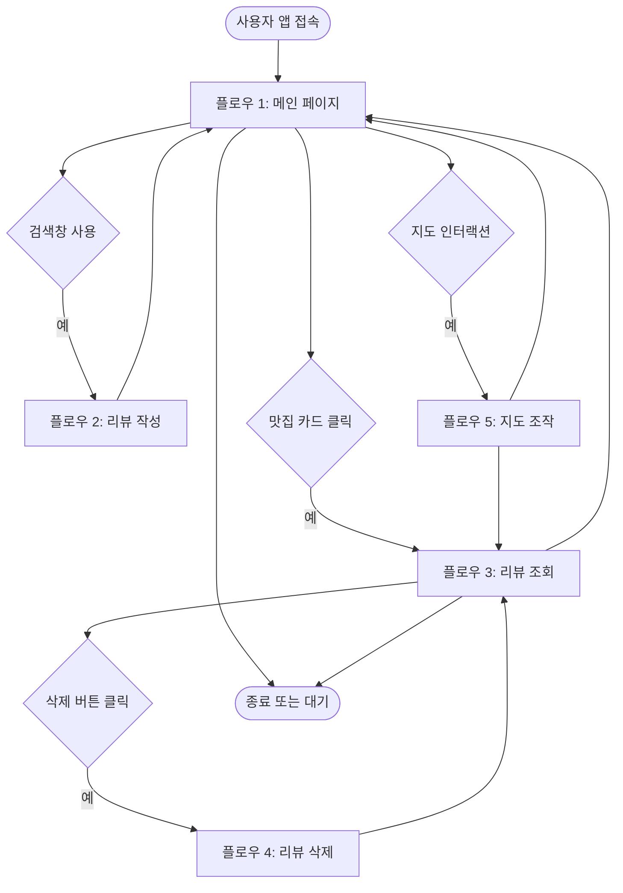

# 사용자 플로우 문서

## 개요

이 문서는 위치 기반 맛집 리뷰 플랫폼의 사용자 플로우를 정의합니다.
본 플랫폼은 비로그인 상태에서 이용 가능하며, 사용자는 맛집을 검색하고 리뷰를 작성 및 조회할 수 있습니다.

---

## 플로우 1: 메인 페이지 접속 및 탐색

### 시작점
사용자가 애플리케이션의 루트 URL에 접속

### 종료점
사용자가 메인 페이지의 콘텐츠를 확인하고 다른 액션을 선택하거나 페이지를 떠남

### 플로우 단계

#### 1. 입력
- 사용자가 브라우저에서 애플리케이션 URL 접속

#### 2. 처리
1. 서버가 메인 페이지 요청을 수신
2. 리뷰가 등록된 맛집 목록 조회 (최신순 또는 인기순)
3. 각 맛집의 위치 정보(위도, 경도) 조회
4. 페이지 렌더링 준비

#### 3. 출력
- 상단: 서비스 소개 섹션 표시
- 중단: 네이버 지도 API를 통한 지도 표시
  - 리뷰가 있는 맛집 위치에 마커 표시
  - 마커 클릭 시 간단한 맛집 정보 툴팁 표시
- 하단: 리뷰가 등록된 맛집 카드 목록 표시
  - 각 카드는 맛집 이름, 대표 이미지, 리뷰 개수, 평균 평점 포함
- 최하단: 음식점 검색창 표시

### 예외 상황

**1. 네트워크 오류**
- 입력: 페이지 로딩 중 네트워크 연결 끊김
- 처리: 오류 감지 및 재시도 로직 실행
- 출력: 오류 메시지 표시 및 새로고침 버튼 제공

**2. 지도 API 로딩 실패**
- 입력: 네이버 지도 API 스크립트 로딩 실패
- 처리: 지도 영역 렌더링 중단, 대체 UI 준비
- 출력: "지도를 불러올 수 없습니다" 메시지 표시, 맛집 목록은 정상 표시

**3. 맛집 데이터 없음**
- 입력: 데이터베이스에 리뷰가 등록된 맛집이 없음
- 처리: 빈 배열 반환
- 출력:
  - 지도는 기본 중심 좌표로 표시
  - 맛집 카드 영역에 "아직 등록된 리뷰가 없습니다" 안내 메시지 표시

### 플로우 다이어그램

---

## 플로우 2: 맛집 검색 및 리뷰 작성

### 시작점
사용자가 메인 페이지 하단의 검색창을 활성화

### 종료점
리뷰 작성 완료 후 메인 페이지로 돌아가거나 작성 취소

### 플로우 단계

#### 1. 입력
- 사용자가 검색창에 음식점 이름 입력
- 검색 버튼 클릭 또는 Enter 키 입력

#### 2. 처리
1. 검색 쿼리 유효성 검증 (빈 문자열, 특수문자 필터링)
2. 네이버 검색 API 또는 장소 API를 통해 음식점 검색
3. 검색 결과 목록 반환 (최대 10개)
4. 각 음식점의 기본 정보 (이름, 주소, 카테고리) 포함

#### 3. 출력
- 검색 결과 목록을 모달 또는 드롭다운 형태로 표시
- 사용자가 특정 음식점 선택
- 리뷰 작성 페이지로 이동 또는 리뷰 작성 모달 표시
  - 음식점 이름 (읽기 전용)
  - 평점 입력 (별점 5점 만점)
  - 리뷰 내용 입력 (텍스트 에리어)
  - 이미지 업로드 (선택 사항)
  - 작성 완료 버튼
  - 취소 버튼

#### 4. 리뷰 제출 처리
1. 입력 데이터 유효성 검증
   - 평점: 1~5 사이의 숫자
   - 리뷰 내용: 최소 10자 이상
   - 이미지: 허용된 형식 및 크기 확인
2. 이미지가 있는 경우 스토리지에 업로드
3. 리뷰 데이터 데이터베이스에 저장
   - 음식점 정보 (없으면 신규 생성)
   - 리뷰 내용, 평점, 이미지 URL
   - 작성 일시 (서버 타임스탬프)
4. 성공 응답 반환

#### 5. 최종 출력
- 성공 메시지 표시 ("리뷰가 등록되었습니다")
- 메인 페이지로 리다이렉트 또는 모달 닫기
- 새로 등록된 리뷰가 맛집 카드 목록에 반영

### 예외 상황

**1. 검색 쿼리가 비어있음**
- 입력: 사용자가 빈 검색창에서 검색 시도
- 처리: 클라이언트 측 유효성 검증
- 출력: "음식점 이름을 입력해주세요" 인라인 오류 메시지

**2. 검색 결과가 없음**
- 입력: 입력한 검색어에 해당하는 음식점 없음
- 처리: API에서 빈 배열 반환
- 출력: "검색 결과가 없습니다. 다른 키워드로 시도해주세요" 메시지

**3. 검색 API 오류**
- 입력: 네이버 API 호출 실패 (할당량 초과, 네트워크 오류 등)
- 처리: 에러 캐치 및 로깅
- 출력: "검색 중 오류가 발생했습니다. 잠시 후 다시 시도해주세요" 알림

**4. 리뷰 작성 유효성 오류**
- 입력: 평점 미선택 또는 리뷰 내용 10자 미만
- 처리: 클라이언트 측 유효성 검증
- 출력:
  - 평점 미선택: "별점을 선택해주세요"
  - 내용 부족: "최소 10자 이상 입력해주세요"
  - 해당 필드에 빨간색 테두리 및 오류 메시지 표시

**5. 이미지 업로드 실패**
- 입력: 이미지 파일이 너무 크거나 지원되지 않는 형식
- 처리: 파일 크기 및 형식 검증
- 출력: "이미지는 JPG, PNG 형식만 가능하며 최대 5MB입니다" 오류 메시지

**6. 서버 저장 실패**
- 입력: 데이터베이스 저장 중 오류
- 처리: 에러 로깅 및 트랜잭션 롤백
- 출력: "리뷰 등록에 실패했습니다. 다시 시도해주세요" 알림 및 작성 내용 유지

**7. 네트워크 끊김**
- 입력: 리뷰 제출 중 네트워크 연결 끊김
- 처리: 타임아웃 감지
- 출력: "네트워크 연결을 확인해주세요" 메시지 및 재시도 버튼

### 플로우 다이어그램

---

## 플로우 3: 맛집 리뷰 조회

### 시작점
사용자가 메인 페이지의 맛집 카드 중 하나를 클릭

### 종료점
리뷰 조회 페이지를 확인하고 메인으로 돌아가거나 다른 액션 수행

### 플로우 단계

#### 1. 입력
- 사용자가 맛집 카드 클릭
- 또는 지도의 마커 클릭 후 "자세히 보기" 선택

#### 2. 처리
1. 선택한 맛집의 고유 ID 추출
2. 서버에 맛집 상세 정보 및 리뷰 목록 요청
3. 맛집 정보 조회
   - 이름, 주소, 카테고리, 평균 평점, 리뷰 개수
4. 해당 맛집의 모든 리뷰 조회
   - 작성 일시 기준 내림차순 정렬
   - 각 리뷰의 평점, 내용, 이미지, 작성 일시 포함
5. 리뷰 조회 페이지 또는 모달 렌더링

#### 3. 출력
- 맛집 상세 정보 섹션
  - 맛집 이름 (헤더)
  - 주소 및 카테고리
  - 평균 평점 (별점 표시)
  - 총 리뷰 개수
  - 작은 지도 (해당 맛집 위치 표시)
- 리뷰 목록 섹션
  - 각 리뷰 카드
    - 평점 (별점)
    - 리뷰 내용
    - 이미지 (있는 경우)
    - 작성 일시
    - 삭제 버튼 (본인이 작성한 리뷰인 경우 - 추후 세션/로컬 기반 식별)
- 하단 액션 버튼
  - "리뷰 작성하기" (동일 맛집에 추가 리뷰 작성)
  - "목록으로 돌아가기"

### 예외 상황

**1. 맛집 정보 조회 실패**
- 입력: 존재하지 않는 맛집 ID로 접근
- 처리: 데이터베이스에서 NULL 반환
- 출력: "맛집 정보를 찾을 수 없습니다" 오류 페이지 또는 모달

**2. 리뷰 목록이 비어있음**
- 입력: 해당 맛집에 등록된 리뷰가 없음 (실제로는 메인에서는 보이지 않지만 직접 URL 접근 가능)
- 처리: 빈 배열 반환
- 출력: 맛집 정보는 표시하되, "아직 리뷰가 없습니다. 첫 리뷰를 작성해보세요!" 메시지

**3. 네트워크 오류**
- 입력: 데이터 로딩 중 네트워크 끊김
- 처리: 타임아웃 또는 연결 실패 감지
- 출력: "페이지를 불러올 수 없습니다" 오류 메시지 및 재시도 버튼

**4. 이미지 로딩 실패**
- 입력: 리뷰 이미지 URL이 유효하지 않거나 파일이 삭제됨
- 처리: 이미지 로드 실패 이벤트 캐치
- 출력: 대체 이미지(placeholder) 표시 또는 이미지 영역 숨김

**5. 지도 표시 실패**
- 입력: 네이버 지도 API 로딩 실패 또는 위치 정보 없음
- 처리: 지도 렌더링 에러 캐치
- 출력: 지도 영역에 "지도를 표시할 수 없습니다" 메시지, 나머지 정보는 정상 표시

### 플로우 다이어그램

---

## 플로우 4: 리뷰 삭제

### 시작점
사용자가 리뷰 조회 페이지에서 특정 리뷰의 삭제 버튼 클릭

### 종료점
리뷰 삭제 완료 또는 취소 후 리뷰 조회 페이지에 남음

### 플로우 단계

#### 1. 입력
- 사용자가 리뷰 카드의 "삭제" 버튼 클릭
- (본인이 작성한 리뷰로 식별된 경우만 버튼 노출)

#### 2. 처리
1. 삭제 확인 다이얼로그 표시
   - "정말 이 리뷰를 삭제하시겠습니까?"
   - "삭제" 버튼 / "취소" 버튼
2. 사용자가 "삭제" 선택 시
3. 리뷰 ID 추출
4. 서버에 삭제 요청 전송
5. 서버 처리
   - 리뷰 ID 유효성 확인
   - 해당 리뷰가 존재하는지 확인
   - 리뷰와 연결된 이미지가 있으면 스토리지에서 삭제
   - 데이터베이스에서 리뷰 레코드 삭제 (또는 soft delete)
   - 맛집의 평균 평점 재계산
6. 성공 응답 반환

#### 3. 출력
- 삭제 성공 메시지 표시 ("리뷰가 삭제되었습니다")
- 리뷰 목록에서 해당 리뷰 카드 제거
- 맛집 평균 평점 및 리뷰 개수 업데이트
- 만약 마지막 리뷰였다면
  - "아직 리뷰가 없습니다" 상태로 변경
  - 메인 페이지의 맛집 카드 목록에서도 해당 맛집 제거 (리뷰 없으면 노출 안 됨)

### 예외 상황

**1. 삭제 권한 없음**
- 입력: 다른 사용자가 작성한 리뷰 삭제 시도 (직접 API 호출 등)
- 처리: 서버에서 권한 검증 실패
- 출력: "삭제 권한이 없습니다" 오류 메시지

**2. 리뷰가 이미 삭제됨**
- 입력: 다른 세션에서 이미 삭제된 리뷰 삭제 시도
- 처리: 데이터베이스에서 리뷰를 찾을 수 없음
- 출력: "이미 삭제된 리뷰입니다" 알림 후 페이지 새로고침

**3. 네트워크 오류**
- 입력: 삭제 요청 중 네트워크 끊김
- 처리: 타임아웃 또는 연결 실패 감지
- 출력: "삭제에 실패했습니다. 네트워크 연결을 확인해주세요" 메시지 및 재시도 버튼

**4. 서버 오류**
- 입력: 데이터베이스 삭제 중 예상치 못한 오류
- 처리: 에러 로깅 및 트랜잭션 롤백
- 출력: "삭제 중 오류가 발생했습니다. 잠시 후 다시 시도해주세요" 알림

**5. 이미지 삭제 실패**
- 입력: 스토리지에서 이미지 삭제 실패 (권한, 파일 없음 등)
- 처리: 이미지 삭제 오류는 로깅하되, 리뷰 레코드는 삭제 진행
- 출력: 사용자에게는 성공 메시지 (이미지 정리는 백그라운드 작업)

**6. 사용자가 삭제 취소**
- 입력: 확인 다이얼로그에서 "취소" 버튼 클릭
- 처리: 다이얼로그 닫기
- 출력: 리뷰 조회 페이지 유지, 아무런 변경 없음

### 플로우 다이어그램

---

## 플로우 5: 지도 인터랙션

### 시작점
사용자가 메인 페이지의 지도 영역에서 상호작용 시작

### 종료점
지도 조작 완료 또는 다른 UI 요소로 이동

### 플로우 단계

#### 1. 입력
- 사용자가 지도를 드래그하여 이동
- 또는 확대/축소 버튼 클릭
- 또는 맛집 마커 클릭

#### 2. 처리

**지도 이동/확대/축소**
1. 네이버 지도 API의 이벤트 리스너 감지
2. 현재 중심 좌표 및 줌 레벨 변경
3. 새로운 영역에 있는 맛집 마커 표시
4. 부드러운 애니메이션 적용

**마커 클릭**
1. 클릭된 마커의 맛집 ID 추출
2. 해당 맛집의 간단한 정보 조회
3. 지도 위에 인포윈도우(툴팁) 표시
   - 맛집 이름
   - 평균 평점
   - 리뷰 개수
   - "자세히 보기" 링크 버튼

#### 3. 출력
- 지도 이동 시: 새로운 영역 및 마커 표시
- 마커 클릭 시: 인포윈도우 표시
- "자세히 보기" 클릭 시: 플로우 3 (리뷰 조회)으로 이동

### 예외 상황

**1. 지도 조작 중 오류**
- 입력: 지도 API에서 예상치 못한 오류
- 처리: 오류 캐치 및 로깅
- 출력: 지도 상태 유지, 오류 무시 (UX 방해 최소화)

**2. 마커 정보 로딩 실패**
- 입력: 마커 클릭 시 맛집 정보 조회 실패
- 처리: API 오류 캐치
- 출력: 인포윈도우에 "정보를 불러올 수 없습니다" 간단한 메시지

**3. 너무 많은 마커**
- 입력: 확대된 영역에 맛집이 100개 이상
- 처리: 마커 클러스터링 적용 또는 상위 N개만 표시
- 출력: 마커 그룹 표시 또는 "확대하면 더 많은 맛집을 볼 수 있습니다" 안내

### 플로우 다이어그램

---

## 전체 플로우 다이어그램

---

## 부록: 공통 에러 처리 원칙

### 1. 클라이언트 측 검증
- 사용자 입력은 서버 전송 전 클라이언트에서 1차 검증
- 즉각적인 피드백으로 UX 개선
- 필수 필드, 형식, 길이 등 기본 검증

### 2. 서버 측 검증
- 클라이언트 검증을 통과해도 서버에서 재검증
- 보안 위협 방지 및 데이터 무결성 보장
- 비즈니스 로직 검증 (중복 체크, 권한 등)

### 3. 네트워크 오류
- 타임아웃 설정 (예: 10초)
- 재시도 로직 (최대 3회)
- 사용자에게 명확한 오류 메시지 및 재시도 옵션 제공

### 4. 서버 오류
- 500번대 오류는 사용자에게 기술적 세부사항 노출 금지
- "잠시 후 다시 시도해주세요" 같은 친절한 메시지
- 서버 로그에 상세 에러 기록

### 5. 낙관적 업데이트
- 삭제, 등록 등 빠른 피드백이 중요한 작업은 낙관적 UI 업데이트
- 서버 응답 실패 시 롤백 및 오류 표시

### 6. 로딩 상태
- 모든 비동기 작업에 로딩 인디케이터 표시
- 스켈레톤 UI 또는 스피너로 사용자 대기 불안 감소

### 7. 접근성
- 오류 메시지는 스크린 리더가 읽을 수 있도록 ARIA 속성 적용
- 키보드 네비게이션 지원

---

## 변경 이력

| 버전 | 날짜 | 작성자 | 변경 내용 |
|------|------|--------|-----------|
| 1.0  | 2025-10-22 | - | 초안 작성 |

---

## 참고 문서

- 기술 스택: Next.js, Hono, Supabase, 네이버 지도 API
- 인증: 비로그인 (향후 세션/쿠키 기반 리뷰 작성자 식별)
- 디자인 시스템: shadcn-ui, Tailwind CSS
